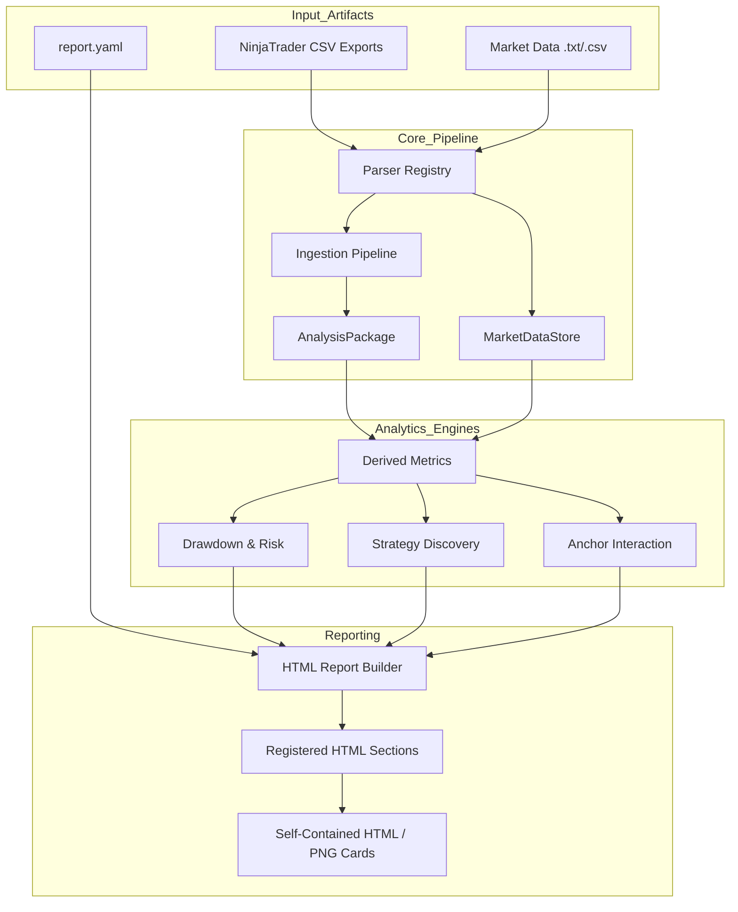
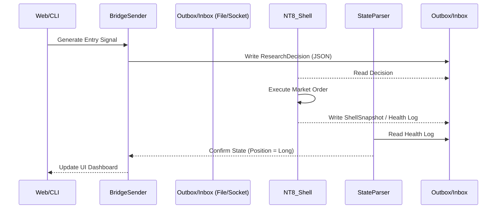

# TA Foundation — Comprehensive User Documentation Manual

## SYSTEM OVERVIEW

### Purpose and Goals
**TA Foundation** is a production-grade analytics and reporting framework designed for NinjaTrader strategy exports. It serves as a unified orchestration engine that ingests strategy outputs alongside shared market data, computes deterministic analytics, and generates self-contained, fully customizable HTML reports. The primary goal is to provide deep insights into trading strategy behavior, regime robustness, market interactions, and execution health through a rigorous, extensible contract.

### High‑Level Capability Map
The system provides several distinct capabilities governed by strict data contracts:

1. **Backtest Report Generation**: Load exported NinjaTrader strategy runs, compute derived metrics, and render comprehensive HTML reports.
2. **Strategy Discovery**: Execute ranking, validation, entry/filter/exit discovery, and NinjaTrader template generation pipelines.
3. **Prediction and Horizon System**: Evaluate daily/horizon prediction jobs with AI agents (LLMs/Analogue), score outcomes, and generate horizon reports independent of backtest packages.
4. **Strategy Template Building**: Formulate structured strategy templates interactively and run localized template backtests.
5. **Execution Bridge**: Facilitate robust real-time or simulated execution messages for NinjaTrader shell integration.
6. **Market Data Dashboard**: Manage and inspect market data file freshness, providing minute/tick caching and aggregation.

### Technology Stack
- **Language**: Python 3.10+
- **Core Analytics**: `pandas`, `numpy`, `scipy`, `scikit-learn`, `pyarrow` (for tick data caching)
- **Data Persistence**: DuckDB (Experiment tracking), Parquet (Tick cache), JSON (State)
- **Reporting**: `pyyaml` (configuration), `matplotlib` (visualizations), `playwright` (headless card export)
- **Testing Framework**: `pytest`

---

## FEATURE‑LEVEL DOCUMENTATION

### 1. Backtest Report Generation
- **What it does:** Ingests directories containing NinjaTrader exports (`*_Trades.csv`, `*_Analysis.csv`, `*_Optimization.csv`, etc.), groups them into canonical runs, computes portfolio risk, drawdown, and daily aggregates, and generates self-contained HTML reports with embedded Base64 charts.
- **Why it exists:** Provides deterministic, offline-capable, highly visual analysis of strategy behavior.
- **How it works:** Driven by the `ParserRegistry` for loading, `AnalysisHelpers` for derivation (e.g., maximum drawdown, daily matrix), and `HtmlReportBuilder` for sequential, YAML-driven HTML section generation.
- **How users interact:** Command-line execution via `ta_foundation.cli.main` using a `report.yaml` configuration.

### 2. Strategy Discovery Reports
- **What it does:** Sweeps large parameter spaces for entry patterns (e.g., Large Candle Regions, Bollinger Bands, Breakout, ORB) and ranks the best-performing combos via out-of-sample validation.
- **How it works:** Uses `strategy_discovery` YAML directives to run discovery orchestrators over market data, bypassing standard ingest if operating purely on signals.
- **How users interact:** Included as configurations within `report.yaml` (e.g., `strategy_discovery:`) and rendered in HTML sections under the "Strategy Discovery" category.

### 3. Prediction and Horizon System
- **What it does:** Uses historical analogue matching and LLM integration to predict market direction at various horizons (e.g., 5m, 15m, EOD).
- **How it works:** Loads market data into a `MarketDataStore`, extracts feature vectors, runs prediction agents (`AnalogueProbabilityAgent`, `ClaudeMarketAgent`), and scores outcomes objectively using the `horizon_scorer`.
- **How users interact:** Run standalone via `python -m ta_foundation.prediction.run_prediction --config prediction.yaml`.

### 4. Execution Bridge
- **What it does:** Connects the abstract analytical logic to an actionable trading engine (e.g., NT8 shell). It generates signal envelopes (entry, stop-loss trailing, take-profit).
- **How it works:** Implements a file/socket-based outbox/inbox loop (`bridge_sender.py`, `real_strategy_loop.py`) with strict state assertions and fallback mechanics (heartbeat, downgrade).
- **How users interact:** Execution operators run `cli/bridge_operator.py` and `cli/soak_monitor.py`.

---

## ARCHITECTURE VISUALS

### 1. System Architecture Data Flow



### 2. Execution Bridge Component Interaction



---

## WORKFLOWS

### Standard Ingestion & Report Workflow
1. **Prepare Data:** Export NinjaTrader strategies to a directory (e.g., `D:/MarketData/Runs`). Export shared market minute/tick data.
2. **Configure YAML:** Create or modify `report.yaml` to include desired reporting sections (e.g., `section_overview`, `section_daily_winner_board`).
3. **Run CLI:**
   ```bash
   python -m ta_foundation.cli.main \
     --input "D:/MarketData/Runs" \
     --output "./outputs" \
     --report-config "./report.yaml" \
     --market-data "D:/MarketData" \
     --recursive
   ```
4. **Review Outputs:** Open `./outputs/report.html` to view the self-contained dashboard.

### Prediction & Horizon Workflow
1. **Configure Agent:** Set up `prediction.yaml` specifying agents (e.g., Analogue, Claude).
2. **Execute Prediction Job:**
   ```bash
   python -m ta_foundation.prediction.run_prediction --config prediction.yaml
   ```
3. **Backtest Horizons (Walk-Forward):**
   ```bash
   python -m ta_foundation.prediction.backtest_horizon_predictions \
     --minute-bars-file data.Last.txt \
     --store-dir ./prediction_store
   ```

---

## API / MODULE REFERENCE

### CLI Commands
- `python -m ta_foundation.cli.main`: Main entry point for ingestion and report rendering.
  - `--input`: Source directory of strategy exports.
  - `--output`: Destination for the HTML report and manifest.
  - `--report-config`: Path to the YAML configuration.
  - `--market-data`: Path to shared minute/tick data.
  - `--no-tick-data`: Bypass tick load for faster, minute-bar-only testing.
- `python market_data_dashboard.py`: Launch the Flask-based dashboard for market data inspection.
- `python -m ta_foundation.prediction.run_prediction`: Run isolated horizon predictions.
- `python scripts/build_ai_index.py`: Refresh the AI indexing documentation context.

### Core Modules
* **`ta_foundation.core.model`**: Defines `AnalysisPackage` (run-scoped constraints) and `SummaryBlock`.
* **`ta_foundation.marketdata.store`**: Defines `MarketDataStore` for canonical shared data.
* **`ta_foundation.parsers.registry`**: The extensible `ParserRegistry` class that routes files to proper parser classes based on regex/extensions.
* **`ta_foundation.reports.html.builder`**: Drives the execution loop parsing `ReportConfig` and mapping to `HtmlSection` renderers.
* **`ta_foundation.analysis.strategy_discovery`**: Orchestrator containing sub-modules for sweeps (e.g., `lcr_sweep.py`, `breakout_sweep.py`).

### Data Contracts (Time Handling)
- **Timezone Policy**: All datetimes are timezone-aware and localized strictly to `America/Denver`.
- **Naive Datetimes**: Forbidden at the pipeline and analysis layers.

---

## ADVANCED SECTIONS

### Extensibility Guide
TA Foundation operates on a strict four-layer contract allowing seamless enhancements:
1. **Parsers (`src/ta_foundation/parsers`)**: To support a new NinjaTrader export format, inherit from `Parser` and register it in `ParserRegistry`.
2. **Pipeline (`src/ta_foundation/core/pipeline.py`)**: Responsible for constructing the `AnalysisPackage` deterministically.
3. **Analysis Helpers (`src/ta_foundation/analysis`)**: Add stateless statistical functions or derived metric calculators (e.g., regime classification).
4. **Report Sections (`src/ta_foundation/reports/html/sections`)**: Create a new `.py` file with a function that takes an `AnalysisPackage` and configuration kwargs, rendering an HTML string. Register it using the section decorator.

### Security Considerations
- **Data Privacy**: Strategy exports may contain proprietary logic names and financial PNL. Ensure `output/` directories are securely stored and git-ignored (enforced via `.gitignore`).
- **Execution Bridge Safety**: The `BridgeSender` implements strict sanity checks on order sizes, instrument names, and timestamp validity (rejecting messages with historical timestamps >15 seconds old). Always use `soak_monitor.py` when live trading to alert on heartbeat failures.
- **RAG/AI Overload**: Do not expose `logs/`, `.venv/`, or `.duckdb` files to LLM agents processing context; always abide by the `docs/AI_REPO_INDEX.md` ignore policies to prevent context hijacking or token limit exhaustion.

### Troubleshooting
- **Error: "Timezone naive datetime found in AnalysisPackage"**: Ensure any new parser correctly localizes timestamps using the framework's time utilities (`_to_denver`).
- **Missing Images in Report**: Ensure `matplotlib` is installed and `--include-run-images` or proper YAML flags for image embedding are enabled. Wait for `fig_to_base64_png` execution to complete.
- **Market Data Not Linking**: Strategy IDs in the `run_id` must match the instrument convention (e.g., NQ) to bind to `MarketDataStore`. Verify `_infer_instrument_from_run_id` logic.
- **Execution Shell Disconnects**: Verify that the outbox directory paths in `soak_monitor.py` match your shell configuration. Check the health status logs for timestamp drift over 5 seconds.
