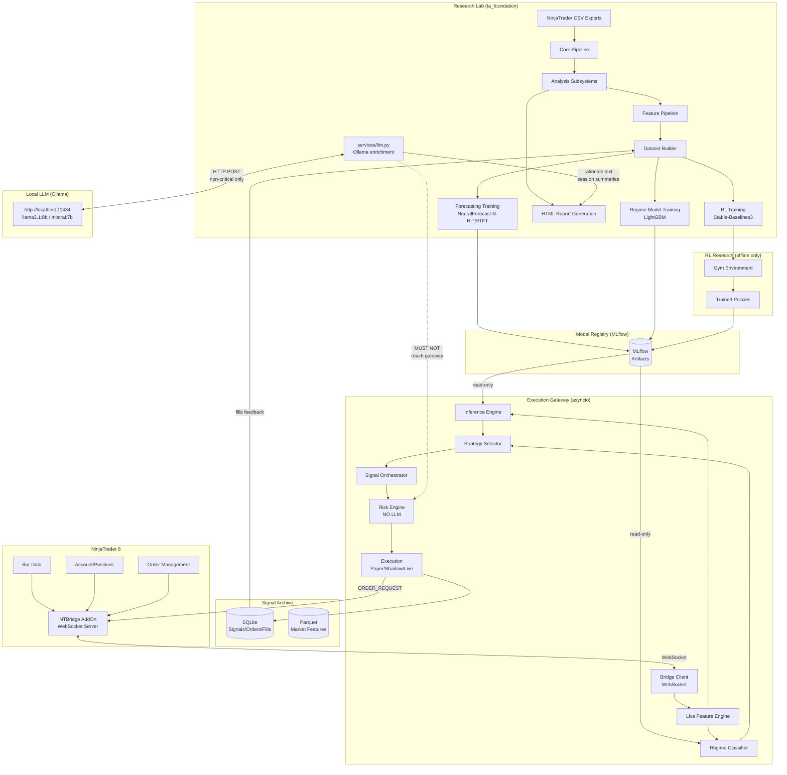
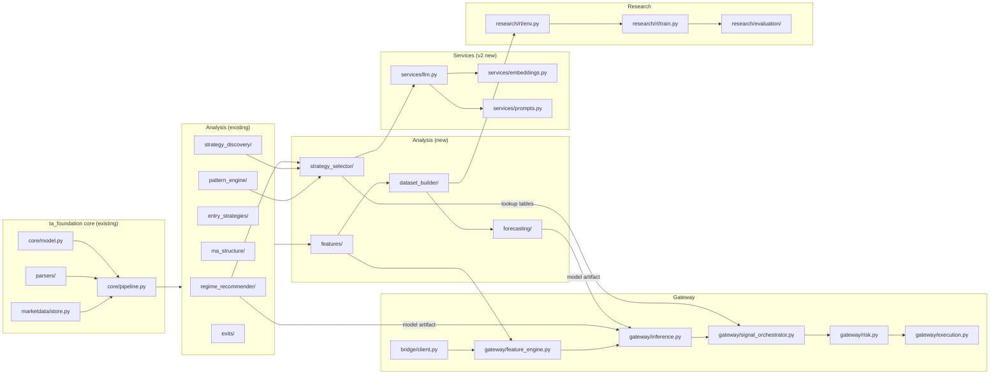
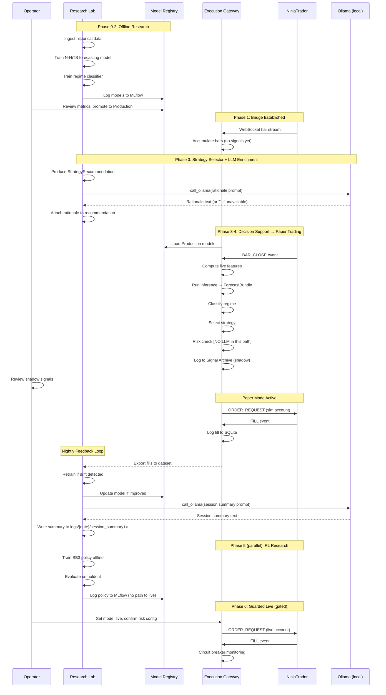

# AI Integration Architecture — ta_foundation (v2)

> **Short summary for humans:**
> This document designs a staged AI integration for ta_foundation: from forecasting models and regime classifiers that support human decisions, through a paper-trading orchestration layer, to a heavily-guarded live execution path. The system is designed so that the research environment and the live execution gateway are architecturally separated and can never short-circuit into each other. Nothing touches live capital until it has passed through simulation, paper trading, shadow mode, and explicit human sign-off.
>
> **v2 additions:** A local LLM enrichment layer (Ollama, `http://localhost:11434`) is added for non-critical display paths only — rationale text on report cards, session summaries in the feedback loop, and natural-language dashboard Q&A. The LLM layer is strictly **not** in the risk engine or the 400 ms critical signal path.

---

## Assumptions

1. NinjaTrader 8 is the only brokerage/execution platform targeted initially.
2. The trading machine runs Windows. Python services run on the same machine or a local LAN node.
3. The user trades futures (NQ/ES class instruments) based on existing data samples.
4. All timestamps are tz-aware America/Denver throughout the system.
5. The operator is a technically sophisticated individual trader, not an institution with a separate risk desk.
6. The system starts in decision-support mode; fully autonomous live execution is a distant, optional endpoint.
7. Internet connectivity is not guaranteed during market hours; the system must tolerate gaps.
8. No cloud compute is assumed for inference; everything runs locally first.
9. Regulatory compliance (e.g., SEC/CFTC reporting) is out of scope for this design.
10. Training runs can happen overnight offline; real-time inference must be lightweight.

## Open Questions / Unknowns

1. Does NinjaTrader's license allow programmatic order submission via a custom AddOn? (Almost certainly yes for personal use, verify for commercial.)
2. What is the acceptable latency for signal-to-order submission? (1–5 seconds is typically fine for discretionary-assist; sub-100 ms matters only for fully autonomous.)
3. Should the AI system ever cancel or modify existing NinjaTrader-placed orders, or only submit new ones?
4. Is GPU available on the trading machine, or will training always be CPU-bound?
5. What is the maximum drawdown threshold beyond which ALL automation must halt?
6. Are there session/instrument restrictions from the broker (prop firm rules, position limits)?
7. Should model training happen on the same machine as live execution, or on a separate offline machine?
8. Is there a desire to eventually multi-broker (e.g., Interactive Brokers) or is NinjaTrader permanently the execution layer?
9. What is the budget tolerance for experiment tracking infrastructure (MLflow self-hosted vs managed)?
10. Should paper trading use NinjaTrader's built-in sim account or a fully synthetic Python-side simulator?
11. **[v2] Is a GPU available for Ollama inference?** llama3.1:8b and mistral:7b run acceptably on CPU at 5–15 tokens/second. qwen2.5:32b requires a GPU with ≥24 GB VRAM or is impractically slow. The default model recommendation assumes CPU-only; confirm hardware before pulling larger models.
12. **[v2] Is Ollama installed and are the required models already pulled?** The LLM enrichment layer assumes `http://localhost:11434` is reachable and that at least `llama3.1:8b` has been pulled (`ollama pull llama3.1:8b`). All LLM calls degrade gracefully to an empty string if Ollama is unavailable — no functionality is blocked.

## Decisions to Validate Experimentally

1. Whether NeuralForecast's N-HiTS or TFT gives better directional accuracy on NQ 5-minute bars.
2. Whether the existing regime classifier in `regime_recommender/` can be fine-tuned with deep features or needs replacement.
3. Whether a WebSocket bridge or named-pipe bridge is more reliable under NinjaTrader's threading model.
4. Whether SB3 PPO with proper reward shaping produces tradeable policies, or whether the RL track is primarily for research insight.
5. Whether the existing pattern engine artifacts are sufficient as RL state features, or whether additional feature engineering is needed.
6. Whether MLflow local tracking is sufficient or whether a dedicated database backend is needed for long-running experiment history.

---

# 1. Executive Summary

## What the Target System Should Become

ta_foundation is currently a powerful **offline analysis and report generation** framework for NinjaTrader strategy exports. The target is to evolve it into a **tiered AI trading intelligence platform** with four distinct capability layers:

| Layer | Description | Timeline |
|---|---|---|
| **Intelligence** | AI-generated forecasts, regime labels, strategy recommendations | Phase 1–3 |
| **Research** | RL-based autonomous agent research, backtesting, simulation | Phase 5 |
| **Paper trading** | Automated signal execution in NinjaTrader sim account | Phase 4 |
| **Live** | Guarded live execution with strict risk controls | Phase 6+ |

The system explicitly preserves the existing analysis and reporting capabilities and builds new AI capabilities as **additive layers**, not replacements.

## Recommended Phased Path

```
Phase 0  →  repository preparation, interface definitions, data schema
Phase 1  →  NinjaTrader bridge + real-time market/account data capture
Phase 2  →  forecasting and regime models (decision support, no execution)
Phase 3  →  strategy recommendation engine (decision support, human executes)
Phase 4  →  paper trading orchestration (automated signals → NT sim account)
Phase 5  →  RL research environment (offline only, never touches live capital)
Phase 6  →  guarded live automation (shadow → canary → guarded)
```

## Key Architectural Decisions

1. **Research and execution are separate codebases/services.** The RL research environment has no network path to the live execution gateway. This is enforced structurally, not just by policy.

2. **NinjaTrader is the execution authority.** Python services are the intelligence layer; NinjaTrader holds positions, fills orders, and manages risk stops. Python never has custody of live capital state.

3. **The bridge is a thin, typed message contract.** NinjaTrader and Python talk over a local WebSocket connection with a defined JSON schema. Neither side embeds the other's business logic.

4. **Forecasting comes before execution.** The system produces forecasts and recommendations that humans act on for at least one phase before any automation is attempted.

5. **MLflow is the model registry.** All model training runs, hyperparameters, metrics, and artifacts are tracked in MLflow from Phase 2 onward.

6. **NeuralForecast is the primary forecasting library.** It is purpose-built for time series, supports probabilistic outputs, and has clean scikit-learn-compatible APIs.

7. **Stable-Baselines3 is the RL library.** Simple, well-documented, sufficient for research-phase agents. RLlib is available as an upgrade path if distributed training becomes necessary.

8. **[v2] Ollama is the local LLM service.** All calls target `http://localhost:11434`. The LLM is used exclusively for enrichment and display (rationale text, session summaries, dashboard Q&A). It is never in the risk engine or the critical signal path. All LLM calls are optional and fail silently.

## Biggest Risks and Dependencies

| Risk | Severity | Mitigation |
|---|---|---|
| NinjaTrader bridge instability under real-time load | High | Fault-tolerant reconnect, stateless message design, NT-side heartbeat |
| Model overfitting on limited historical data | High | Walk-forward validation, out-of-sample holdout, MLflow experiment tracking |
| RL agent finding reward exploits instead of real edge | High | Realistic cost models, drawdown penalties, kill-switch conditions |
| Accidental live execution during development | Critical | Hard separation of research/execution codebases, paper-mode flag that cannot be runtime-overridden |
| NinjaTrader API changes breaking the bridge | Medium | Thin message contract; NT-side logic is minimal and easily rebuilt |
| Feature drift causing model degradation in production | Medium | Drift monitoring, scheduled retraining triggers, model confidence thresholds |
| Ollama unavailable or model not pulled | Low | All LLM calls return empty string on failure; no blocking dependency |

---

# 2. Current-State Repository Assessment

## What ta_foundation Currently Does

ta_foundation ingests NinjaTrader strategy export files (CSV/TXT), runs a battery of offline analyses, and renders self-contained HTML reports. It is a **batch processing system** — it never runs during market hours and has no network connections.

## Existing Components

### Analysis Subsystems (directly reusable in AI pipeline)

<!-- @ANNOTATION [2026-04-07]: Family count is now 9 — premarket_sweep.py was added
     alongside the original 8 (candle, ma, orb, bb, breakout, pullback, level, lcr).
     Also note: analysis/market_regime_store.py, analysis/trade_entry_signal_store.py,
     and analysis/trade_feature_store.py exist but are not listed here; they are
     potentially relevant as lightweight in-memory stores for the live feature pipeline. -->

| Subsystem | Location | Reusable As |
|---|---|---|
| Entry strategy sweep (9 families) | `analysis/entry_strategies/` | Feature engineering pipeline input, RL action space definition |
| Pattern engine | `analysis/pattern_engine/` | Historical signal corpus, RL state space features |
| MA anchor interaction | `analysis/ma_structure/` | Regime feature input, anchor-based target/stop levels |
| Strategy discovery | `analysis/strategy_discovery/` | Walk-forward validation framework, MAE/MFE profiling |
| Regime recommender | `analysis/regime_recommender/` | Regime label generation, direct input to AI strategy selector |
| Exit simulation | `analysis/exits/` | RL environment reward engine, paper trading exit logic |
| Outcome simulator | `analysis/entry_strategies/outcome/` | RL episode outcome ground truth |
| Trade enrichment | `analysis/trade_enrichment.py` | Post-trade feature extraction |
| Leaderboards | `analysis/leaderboards.py` | Model evaluation leaderboards |

### Data Infrastructure (directly reusable)

| Component | Location | Reusable As |
|---|---|---|
| MarketDataStore | `marketdata/store.py` | Historical bar cache, basis for live bar aggregation |
| Tick cache | `marketdata/tick_cache.py` | High-resolution data storage |
| OHLCV resampling | `marketdata/resample.py` | Multi-timeframe feature engineering |
| Parquet artifact system | `analysis/pattern_engine/io.py` | Model artifact storage |
| AnalysisPackage | `core/model.py` | Context object for passing data to AI modules |

<!-- @ANNOTATION [2026-04-07] — MarketDataStore structure:
     - Holds RAW per-contract data keyed by (instrument_root, contract) tuples.
       e.g. ("NQ", "H26") for NQ March 2026 bars.
     - NOT back-adjusted or continuous. Each physical contract is stored separately.
     - finalize() merges all contracts for a root into a merged key (instrument_root, "")
       by concatenating, sorting on "dt", and deduplicating timestamps. After finalize(),
       callers query ("NQ", "") to get the full merged dataset across all loaded contracts.
     - files: store.py, model.py, resample.py, tick_cache.py
     - The live bar aggregation design in Section 5.1 must account for this contract-keyed
       structure; a live bar arriving for "NQ 06-26" maps to root "NQ". -->

<!-- @ANNOTATION [2026-04-07] — Pattern engine artifact structure confirmed:
     Artifacts land in .ta_artifacts/pattern_engine/<safe_run_id>/ where safe_run_id
     replaces colons with "__" for Windows compatibility. The directory is actively in use
     with 200+ run folders present on this machine. -->

### Report System (reusable for AI monitoring)

<!-- @ANNOTATION [2026-04-07]: Section count is 100+, not 70+. CLAUDE.md says "100+ files"
     and the glob of reports/html/sections/ confirms this. The "70+" figure is outdated. -->
The 100+ section renderers can accept AI-generated data via `pkg.metadata["derived"]` and `pkg.assets` without modification. New AI sections can be added following the existing pattern.

### Config System (reusable)

The YAML report config system already supports per-module feature blocks. AI modules can declare their own top-level YAML blocks using the same convention.

<!-- @ANNOTATION [2026-04-07] — Existing test coverage (not mentioned in document):
     13 test files found in src/ta_foundation/tests/:
       analysis/entry_strategies/test_entry_strategies.py
       analysis/ma_structure/test_orchestrator.py
       analysis/ma_structure/test_tp_sl_engine.py
       analysis/ma_structure/test_trade_alignment.py
       analysis/ma_structure/tst.py  (ad-hoc, not pytest-structured)
       analysis/regime_recommender/test_features_classifier.py
       analysis/regime_recommender/test_outcomes.py
       analysis/regime_recommender/test_recommender_orchestrator.py
       analysis/regime_recommender/test_storage.py
       analysis/strategy_discovery/test_strategy_discovery.py
       analysis/strategy_metadata/test_strategy_metadata_extractor.py
       parsers/test_optimization_csv.py
       reports/html/sections/test_regime_parameter_recommendation.py
     Coverage gaps relevant to AI integration: no tests for features/, exits/simulate.py,
     outcome/simulator.py, or marketdata/ modules. Phase 0 should add tests for these
     before relying on them as AI pipeline components. -->

## Technical Debt and Architecture Constraints

1. **Batch-only pipeline**: `cli/main.py` is a synchronous, single-pass pipeline. Live data requires an event loop. A new `live/` service layer must be created; `cli/main.py` should not be modified to handle streaming.

2. **No message bus**: Components communicate through shared Python objects. Adding distributed or async components requires an explicit IPC layer (ZeroMQ recommended).

3. **No model versioning**: Analysis results are attached to packages but not versioned. MLflow integration must be added before models go to production.

4. **No database**: Everything persists to parquet or HTML. Orders, fills, positions, and account state need a lightweight structured store (SQLite is sufficient initially).

5. **AnalysisPackage is batch-scoped**: It represents a completed backtest run, not a live session. Live data will need either a parallel live package concept or a separate live context object.

6. **Regime recommender is relatively young**: Added March 30, 2026. Has limited production validation. Should be treated as v0 for AI integration purposes.

<!-- @ANNOTATION [2026-04-07]: The document is correct that the module is young, but
     incomplete on what it IS. The regime_recommender is a DETERMINISTIC RULE-BASED
     classifier — no ML model fitting occurs anywhere in its 8 files. It uses EMA slope
     on 15m/60m/240m bars and ATR/compression ratios with hardcoded thresholds in
     classify_regime(). It outputs a RegimeClassification with primary regime (trend_up /
     trend_down / range) + secondary attributes (vol_expanding etc.) + a confidence score
     that is computed arithmetically from data quality and certainty measures, not from
     model calibration. This is important for Section 7b: the "rule-based layer" IS the
     current classifier in its entirety — there is no existing "learned layer" to extend.
     Section 7b correctly designs the learned layer as NEW work (XGBoost/LightGBM on top),
     but readers may assume some ML already exists here. It does not. -->

7. **Strategy discovery phases 1–2 are stubs**: Entry/exit discovery automation is incomplete. The AI integration should not depend on these being finished.

<!-- @ANNOTATION [2026-04-07] — CORRECTION: This claim appears to be INACCURATE as of
     the current codebase. Code inspection found:
     - pure_discovery.py: 649 lines, fully implemented. Contains template_library(),
       trigger_mask(), confirmation_mask(), regime_mask(), assemble_candidates(),
       pruning and leaderboard building. No 'pass', 'NotImplementedError', or TODO stubs.
     - entry_pattern_bridge.py: 679 lines, fully implemented. Contains
       build_signal_feature_matrix(), match_trades_to_signals(), discover_entry_patterns().
       No stub patterns found.
     - orchestrator.py: 419 lines, fully implemented. Orchestrates regime labeling,
       MAE/MFE, walk-forward validation, exit discovery, feature matrix, classification.
     - validation.py: 450+ lines, uses scipy.stats.ttest_rel for actual statistical tests.
     The AI integration may safely depend on these modules. Re-verify before Phase 3
     work begins in case the "stubs" label refers to a specific sub-feature rather than
     the overall modules. -->

## Gaps That Must Be Filled

| Gap | Required For |
|---|---|
| Real-time market data ingestion | Phase 1+ |
| NinjaTrader bridge (bidirectional) | Phase 1+ |
| Order, fill, and position data model | Phase 1+ |
| Feature store with timestamps | Phase 2+ |
| Model training pipeline | Phase 2+ |
| Model registry (MLflow) | Phase 2+ |
| Paper trading harness | Phase 4 |
| RL gym environment | Phase 5 |
| Risk engine | Phase 4+ |
| Live execution gateway | Phase 6 |
| Monitoring and alerting | Phase 4+ |
| Local LLM service (Ollama) | Phase 3+ (enrichment only) |

---

# 3. Target Capabilities

## Research

| Capability | Description | Automation Level |
|---|---|---|
| Historical backtesting | Replay of strategies on historical data | Batch (existing) |
| Feature importance analysis | Identify predictive signals | Batch (existing) |
| Walk-forward validation | IS/OOS split testing | Batch (existing) |
| Forecasting model training | Train DL models on bar data | Batch (new) |
| Regime model training | Classify market conditions | Batch (new) |
| RL agent training | Autonomous policy learning | Batch offline (new) |
| Monte Carlo robustness | Stress test strategies | Batch (existing) |
| Hyperparameter search | Optimize model parameters | Batch (new) |

## Simulation

| Capability | Description | Automation Level |
|---|---|---|
| Tick/bar replay | Simulate exact historical execution | Batch (existing) |
| Slippage/commission modeling | Realistic cost simulation | Batch (existing) |
| RL episode rollout | Agent acting in simulated market | Offline (new) |
| Policy evaluation | Score RL policies against holdout data | Offline (new) |

## Paper Trading

| Capability | Description | Automation Level |
|---|---|---|
| Signal generation | AI produces entry/exit signals | Semi-automated |
| NinjaTrader sim execution | Signals submitted to NT sim account | Automated (new) |
| P&L tracking | Track paper performance | Automated (new) |
| Performance comparison | Paper vs backtest vs live | Automated (new) |

## Live Trading

| Capability | Description | Automation Level |
|---|---|---|
| Shadow mode | Signals generated but NOT submitted | Automated (new) |
| Canary live | Small size, heavily monitored | Semi-automated (new) |
| Guarded live | Full size with hard risk controls | Automated (new, Phase 6+) |

## Post-Trade Learning

| Capability | Description | Automation Level |
|---|---|---|
| Post-trade analytics | Analysis of completed trades | Batch (extend existing) |
| Forecast error analysis | Compare predictions to outcomes | Batch (new) |
| Model drift detection | Monitor feature distributions | Automated (new) |
| Retraining triggers | Automated or manual retraining | Semi-automated (new) |
| Feedback injection | Push live results into training | Batch (new) |

## Operator Monitoring

| Capability | Description |
|---|---|
| Live dashboard | Position, P&L, signal status, model health |
| Alert system | Breach of risk limits, stale data, bridge disconnect |
| Audit trail | All signals, orders, fills logged with timestamps |
| Manual override | Operator can halt all automation instantly |
| **[v2] LLM Q&A panel** | Natural-language queries about current regime and session (Ollama; never in signal path) |

## Model Governance

| Capability | Description |
|---|---|
| Model registry | All trained models versioned and stored |
| Experiment tracking | All training runs logged with metrics |
| Champion/challenger | New models must outperform current champion |
| Rollback | Previous model version can be restored in <60 seconds |
| Approval gate | No model can enter paper/live without explicit sign-off |

### Decision Support vs Semi-Automated vs Fully Automated

```
Decision Support   →  AI produces forecasts/recommendations, human decides to trade
Semi-Automated     →  AI produces signals, human approves each before submission
Fully Automated    →  AI produces signals, system submits orders without human approval
```

The design mandates that **Phases 0–3 are decision support only**. Semi-automated paper trading is Phase 4. Fully automated live is Phase 6+ and requires passing explicit safety gates defined in Section 9.

---

# 4. Architecture Options

## Option A: Forecasting-First Modular Architecture

**Description:** Extend the existing batch pipeline incrementally. Add AI modules that attach forecasts and recommendations to `pkg.metadata["derived"]`. The CLI becomes the orchestration entry point for AI analysis, just as it is for existing analysis.

**Core Components:**
- New `analysis/forecasting/` module following existing orchestrator pattern
- NeuralForecast models called from orchestrators
- MLflow tracking inside orchestrators
- No real-time; all AI runs offline on exported data

**Data Flow:**
```
CSV exports → Parsers → Pipeline → Existing Analysis → AI Analysis → Reports
```

**Strengths:**
- Zero architectural disruption
- Reuses all existing infrastructure
- Low implementation risk
- Fast to first results

**Weaknesses:**
- Fundamentally offline; cannot support live trading or paper trading
- No event loop; cannot process streaming data
- AI and analysis tightly coupled to batch pipeline
- Cannot scale to real-time inference without a major rewrite

**Operational Complexity:** Low  
**Implementation Risk:** Low  
**Fit:** Good for Phase 2 forecasting/regime work. Dead end for live trading.

---

## Option B: Event-Driven AI Services Architecture

**Description:** Build a full microservices architecture around an event bus (e.g., Apache Kafka or Redis Streams). Every component is a service; data flows through events.

**Core Components:**
- Message broker (Kafka or Redis Streams)
- Market data service (consumes NT bridge feed)
- Feature service (computes features on incoming bars)
- Forecasting service (consumes features, emits predictions)
- Signal service (consumes predictions, emits signals)
- Order service (consumes signals, submits to NT)
- Risk service (monitors and blocks orders)

**Data Flow:**
```
NT Bridge → market_data topic → feature_service → feature topic
→ forecasting_service → forecast topic → signal_service → signal topic
→ risk_service → order topic → NT Bridge
```

**Strengths:**
- Fully event-driven, scales to real-time
- Clean service boundaries
- Supports multiple consumers per topic (monitoring, logging, RL replay)
- Standard production architecture

**Weaknesses:**
- Massive upfront complexity for a single-user system
- Kafka is severe overkill for one instrument on one machine
- Requires DevOps expertise to operate
- Far from the existing codebase culture

**Operational Complexity:** Very High  
**Implementation Risk:** High  
**Fit:** Architecturally correct but enormously overengineered for this use case. Reject as primary option.

---

## Option C: Research Lab + Execution Gateway Split Architecture (Recommended)

**Description:** Two clearly separated subsystems:

1. **Research Lab** (extends existing ta_foundation): Offline batch analysis, model training, backtesting, RL research. Uses existing pipeline + new AI modules. No network access to live systems.

2. **Execution Gateway** (new service): Lightweight Python service with event loop, NinjaTrader bridge, risk engine, signal orchestration. Consumes pre-trained models from the model registry. No training code.

The two communicate only through the **Model Registry** (MLflow artifacts) and the **Signal Archive** (parquet + SQLite). No shared runtime state.

**Core Components:**
- Research Lab: extended ta_foundation pipeline + MLflow + NeuralForecast + SB3
- Bridge: NinjaScript WebSocket server ↔ Python bridge client (ZeroMQ relay or direct)
- Gateway: async Python service (asyncio), event loop, inference engine, risk engine
- Model Registry: MLflow (local) — shared read-only access from Gateway
- Signal Archive: SQLite + parquet — write from Gateway, read from Research Lab

**Data Flow (Research):**
```
Historical CSVs → ta_foundation Pipeline → AI Training → MLflow Registry
```

**Data Flow (Live):**
```
NT WebSocket → Bridge → Gateway Event Loop
→ [Feature Engine → Inference Engine → Risk Engine → Signal Engine]
→ NT WebSocket (orders) + Signal Archive (logging)
```

**Strengths:**
- Clear safety separation between research and execution
- Existing codebase is not destabilized
- Gateway can be thin and well-tested independently
- Staged deployment is natural: research before execution
- No broker overhead; ZeroMQ or direct WebSocket for local IPC
- Operationally manageable for one person

**Weaknesses:**
- Two separate service deployment concerns
- Model Registry must be accessible from both sides (filesystem path, not network)
- Some feature engineering code must exist in both the offline training pipeline and the Gateway

**Operational Complexity:** Medium  
**Implementation Risk:** Medium  
**Fit:** Best fit. Clear separation of research and execution. Stages naturally. Compatible with existing codebase culture.

---

## Recommendation: Option C

Option C is the recommended architecture. It:
- Keeps the existing ta_foundation batch pipeline intact and productive
- Introduces execution complexity only when execution is actually needed (Phase 4+)
- Enforces the critical safety invariant that research code cannot reach live capital
- Grows naturally from the existing codebase without a rewrite
- Is manageable by one engineer without infrastructure complexity

Option A is used for Phases 0–2 (pure offline AI). Option C's execution gateway is added in Phase 4. Option B patterns (lightweight event streaming) are adopted locally within the Gateway using ZeroMQ, not Kafka.

---

# 5. Recommended System Architecture

## Subsystem Overview

```
┌─────────────────────────────────────────────────────────────────────────┐
│                         RESEARCH LAB                                     │
│   ta_foundation (extended)                                               │
│                                                                          │
│  [Historical Data] → [Feature Pipeline] → [Model Training] → [Registry] │
│  [Backtest Engine]   [Regime Models]       [RL Research]    [Reports]   │
└──────────────────────────────────┬──────────────────────────────────────┘
                                   │ Model artifacts (read-only)
                                   ↓ via shared filesystem / MLflow
┌─────────────────────────────────────────────────────────────────────────┐
│                        EXECUTION GATEWAY                                 │
│   New Python service (asyncio)                                           │
│                                                                          │
│  [NT Bridge] → [Feature Engine] → [Inference] → [Risk Engine] → [NT]   │
│  [Account Monitor]  [Signal Log]  [Paper Mode]  [Live Mode]            │
└──────────────────────────────────┬──────────────────────────────────────┘
                                   │ Fills, positions, signals
                                   ↓ via Signal Archive
┌─────────────────────────────────────────────────────────────────────────┐
│                        FEEDBACK LOOP                                     │
│   Nightly batch: export NT fills → enrich → retrain triggers → MLflow  │
└─────────────────────────────────────────────────────────────────────────┘
                                   ↑ enrichment text (non-critical)
┌─────────────────────────────────────────────────────────────────────────┐
│                   LOCAL LLM SERVICE (v2)                                 │
│   Ollama at http://localhost:11434                                        │
│   Rationale text · Session summaries · Dashboard Q&A                    │
│   NEVER in risk engine · NEVER in 400 ms signal path                    │
└─────────────────────────────────────────────────────────────────────────┘
```

---

## 5.1 Market Data Ingestion Layer

**Purpose:** Ingest live market data from NinjaTrader and maintain a real-time bar store.

**Inputs:** Raw tick/quote/bar events from NT bridge (JSON over WebSocket).

**Outputs:** Rolling bar DataFrames (1m, 5m, 15m, 1h) in memory; parquet snapshots to disk on close.

**Ownership Boundary:** Lives in `gateway/market_data.py`. Reads from the bridge; never writes to NT.

**Failure Modes:**
- Bridge disconnect: buffer last-known bars, emit stale-data flag after configurable timeout (default: 30s).
- Malformed message: log and skip; do not crash the event loop.
- Bar timestamp gap: detect and flag; do not silently backfill.

**Telemetry:** bar count per minute, last timestamp received, stale-data flag, gap events.

---

## 5.2 NinjaTrader Integration Layer (Bridge)

See Section 6 for full design. Summary: NinjaScript AddOn running inside NT8 exposes a local WebSocket server. Python `bridge/client.py` connects to it, translates messages into typed Python objects, and relays them to the Gateway via an internal asyncio queue.

**Inputs:** NT8 runtime events (bars, ticks, account state, fills, order updates).

**Outputs:** Typed Python event objects on internal queues; order submission messages back to NT.

**Failure Modes:** Connection drop, NT restart, message queue overflow. All recoverable with reconnect logic.

---

## 5.3 Account and Execution Gateway

**Purpose:** Sole point of contact for order submission. Applies risk checks before any order reaches NT.

**Inputs:** Candidate signals from Signal Orchestrator; account state from bridge.

**Outputs:** OrderRequest messages sent to bridge; order lifecycle events logged to SQLite.

**Ownership Boundary:** `gateway/execution.py`. Nothing outside this module may submit orders.

**Failure Modes:**
- Risk check rejection: log reason, do not submit, emit alert.
- NT rejection (duplicate order, insufficient margin): log, do not retry automatically.
- Fill timeout: alert operator.

**Telemetry:** Orders submitted, rejected, filled, cancelled; slippage per fill; P&L per session.

---

## 5.4 Feature Engineering Pipeline

**Purpose:** Compute model-ready features from raw bars. Must produce identical features in both offline training and live inference.

**Inputs:** OHLCV bars (any timeframe); regime labels; anchor levels from MA analysis.

**Outputs:** Feature DataFrame with named, versioned columns; stored as parquet (offline) or in-memory dict (live).

**Ownership Boundary:** `ta_foundation/analysis/features/` (existing, extend). The same feature computation code is called from both the research lab pipeline and the gateway's live feature engine.

<!-- @ANNOTATION [2026-04-07] — Current state of analysis/features/:
     The module currently has EXACTLY 2 files:
       - microstructure.py: slice_ticks_window(), micro_features_for_time() — tick-window
         features around a timestamp. No session aggregates. Safe for streaming.
       - regime.py: ema(), atr_wilder(), ema_slope(), session_vwap() — bar-level indicators.

     LOOK-AHEAD FLAG: session_vwap() in regime.py groups by calendar date and uses
     groupby().cumsum() to compute VWAP. This is causal WITHIN a session (each bar's VWAP
     uses only bars up to that point in the day), but it anchors to the calendar-date
     session boundary. In a live context where session start time is meaningful (e.g.
     premarket vs RTH), the groupby date anchor is safe as long as bars are processed
     in chronological order. No true look-ahead detected, but verify in live path.

     The BULK of feature computation currently lives in the ENTRY STRATEGY modules, not
     in analysis/features/:
       - analysis/entry_strategies/candle/features.py: 249 lines, ~15 computed columns
         (body/wick ratios, rolling avg comparisons, ATR, session running mean)
       - analysis/entry_strategies/ma/features.py: MA values and slopes
       - analysis/entry_strategies/bb/features.py: Bollinger Band features
     These are NOT currently accessible via analysis/features/ and must be refactored or
     re-exposed for the feature engineering pipeline to be a single shared code path.
     This is the primary gap for Phase 0 feature consolidation. -->

**Critical Requirement:** Feature computation must be deterministic and depend only on data available at bar close. No lookahead. Feature schema must be versioned.

**Failure Modes:** NaN features (missing data): propagate NaN, do not impute in live path. Stale features (old data): flag and halt inference.

---

## 5.5 Historical Dataset Builder

**Purpose:** Assemble labeled training datasets from historical bar data, pattern engine artifacts, and strategy discovery results.

**Inputs:** `MarketDataStore`, pattern engine parquet artifacts, regime labels, entry/exit discovery results.

**Outputs:** Feature matrix parquet + label parquet, train/val/test splits, stored under `.ta_artifacts/datasets/`.

**Ownership Boundary:** `ta_foundation/analysis/dataset_builder/` (new module).

**Telemetry:** Dataset size, label distribution, feature coverage, date range.

---

## 5.6 Forecasting Service

**Purpose:** Produce probabilistic price forecasts across multiple horizons (5, 15, 30, 60 bars).

**Inputs:** Multi-timeframe feature windows; model loaded from MLflow registry.

**Outputs:** `ForecastBundle` — point forecast + quantile intervals per horizon. Stored in `pkg.metadata["derived"]["forecasts"]` (offline) or in-memory dict (live).

**Ownership Boundary:** `ta_foundation/analysis/forecasting/` (new module); `gateway/inference.py` for live path.

**Failure Modes:** Model load failure: fall back to last-known forecast, emit alert. Inference timeout (>500ms): skip forecast for this bar, log.

**Telemetry:** Inference latency, forecast error (MAE/RMSE) vs realized, confidence interval coverage.

---

## 5.7 Regime Classifier

**Purpose:** Label the current market condition (trend direction, volatility state, session phase).

**Inputs:** Feature window (ATR, ADX, volume, price structure). Reuses and extends `analysis/regime_recommender/`.

<!-- @ANNOTATION [2026-04-07] — Confirmed inputs in the actual classifier:
     Inputs are EMA slopes of bar close prices on 15m, 60m, and 240m timeframes (computed
     in features.py via ema() + ema_slope()). The primary decision variable is
     tf240m_trend_slope compared to a threshold. "ADX" and "volume" are mentioned in this
     document but do NOT appear to be inputs in the current implementation. The
     compression_ratio (ATR-relative bar range tightness) is used, but it is computed from
     ATR, not from ADX. Verify before assuming ADX features exist at Phase 2. -->

**Outputs:** `RegimeLabel` — categorical state + confidence score. Stored in `pkg.metadata["derived"]["regime"]`.

<!-- @ANNOTATION [2026-04-07] — Actual storage key is pkg.metadata["derived"]["regime_recommender"],
     not ["regime"]. The RegimeClassification dataclass (in classifier.py) includes:
     regime_id (string), primary (trend_up/trend_down/range), secondary attributes dict,
     confidence (float 0-1), feature_influences dict, diagnostics dict.
     The outputs['regime'] key shown here must be aligned with the actual key before
     the Gateway loads it. -->

**Ownership Boundary:** Extend existing `analysis/regime_recommender/` module.

<!-- @ANNOTATION [2026-04-07] — Module has 8 files: classifier.py, features.py, models.py,
     orchestrator.py, outcomes.py, recommender.py, storage.py, template_export.py.
     Tests: 4 test files covering classifier, features, outcomes, orchestrator, storage.
     Note that models.py exists — its name implies ML models but it likely contains
     dataclasses, not sklearn/torch objects. Verify before Phase 2 extension work. -->

**Failure Modes:** Uncertain classification (low confidence): emit `UNKNOWN` regime; downstream systems treat this as neutral/flat.

---

## 5.8 Strategy Selector

**Purpose:** Map (forecast, regime, time-of-day, instrument) → recommended strategy family + parameter set.

**Inputs:** `ForecastBundle`, `RegimeLabel`, session info, instrument config.

**Outputs:** `StrategyRecommendation` — strategy ID, parameters, confidence, expected edge range.

**Ownership Boundary:** `ta_foundation/analysis/strategy_selector/` (new module). Heavily references existing `strategy_discovery` and `pattern_engine` results.

**Key Design:** The strategy selector does NOT train a new model in the first version. It uses a rule-based lookup table derived from the existing strategy discovery results, with the regime label as the primary key. This is safe, interpretable, and immediately useful.

**Failure Modes:** No matching strategy for current regime: emit `NO_SIGNAL`.

### [v2] LLM Rationale Enhancement

After the strategy selector produces a `StrategyRecommendation`, an optional LLM call generates a one-paragraph rationale explaining the recommendation in plain English. This text is attached to the recommendation object and displayed in the HTML report card for the session. It is **never** used by downstream signal orchestration or risk logic.

```python
# ta_foundation/services/llm.py  (see Section 5.22)
from ta_foundation.services.llm import call_ollama

def enrich_recommendation_rationale(rec: StrategyRecommendation, regime: RegimeLabel) -> str:
    """Return a plain-English rationale. Empty string if Ollama unavailable."""
    prompt = (
        f"You are a trading systems analyst. In 2-3 sentences, explain why "
        f"'{rec.strategy_id}' is recommended given a '{regime.primary}' regime "
        f"(confidence {regime.confidence:.0%}) with expected edge {rec.expected_edge:.2f}. "
        f"Be concise and factual. Do not add caveats about AI limitations."
    )
    return call_ollama(prompt, model="llama3.1:8b", timeout=10.0)
```

**Contract:** If `call_ollama` returns an empty string (Ollama unavailable, timeout, model not pulled), the `StrategyRecommendation.rationale` field is set to `""` and the report card simply omits the rationale section. No exception is raised and no signal is delayed.

---

## 5.9 RL Research Environment

**Purpose:** A Gym-compatible environment for training autonomous trading agents on historical data. Strictly offline.

**Inputs:** Historical feature matrices, historical OHLCV data, cost model config.

**Outputs:** Trained policy artifacts stored in MLflow.

**Ownership Boundary:** `research/rl/` (new top-level package, separate from `src/ta_foundation`). Has no imports from `gateway/`.

**Network Access:** None. This process must not have a network path to the execution gateway.

**Failure Modes:** N/A — offline research tool.

---

## 5.10 Policy Evaluation Service

**Purpose:** Score trained RL policies on a held-out historical dataset before any paper trading consideration.

**Inputs:** Policy artifact from MLflow; holdout feature matrix.

**Outputs:** Evaluation report (Sharpe, max drawdown, win rate, MAE/MFE) stored as MLflow artifact.

**Ownership Boundary:** `research/evaluation/` (new).

**Gate:** A policy may only progress to paper trading consideration after passing evaluation thresholds defined in `research/evaluation/thresholds.yaml`.

---

## 5.11 Risk Engine

**Purpose:** Pre-trade risk checks. Blocks any order that violates configured constraints.

**Inputs:** Candidate order; current positions; account state; session config.

**Outputs:** `RiskDecision` — APPROVE or REJECT with reason code.

**Ownership Boundary:** `gateway/risk.py`. Stateless; all state passed in. Independently testable.

**Checks (minimum required before live trading):**
- Daily loss limit not exceeded
- Max position size not exceeded
- Instrument is in the allowed list
- Current time is within allowed trading session
- Model confidence exceeds minimum threshold
- Bridge is connected and data is fresh
- No duplicate order (same signal ID already submitted)
- Account in paper/sim mode if `live_mode=False`

**Failure Modes:** Any check failure → REJECT. Default on error is REJECT.

> **[v2] Hard constraint:** The LLM service (`call_ollama`) must NEVER be called from within the risk engine or any code path that executes between feature computation and order submission. The 400 ms latency budget in Section 6 assumes zero LLM calls. LLM enrichment happens only in post-trade batch paths (Sections 5.18, 5.22) and report rendering.

---

## 5.12 Signal Orchestration Layer

**Purpose:** Coordinate forecasts, regime labels, and strategy recommendations into a single `TradingSignal` per bar.

**Inputs:** `ForecastBundle`, `RegimeLabel`, `StrategyRecommendation`, account state.

**Outputs:** `TradingSignal` — direction, entry price, stop, target, position size, confidence, TTL.

**Ownership Boundary:** `gateway/signal_orchestrator.py`.

**Failure Modes:** Conflicting signals: no signal emitted. Missing inputs: no signal emitted. Signals expire after `TTL` bars; expired signals are discarded.

---

## 5.13 Model Registry

**Tool:** MLflow (local, self-hosted).

**Purpose:** Version and store all trained model artifacts, hyperparameters, and evaluation metrics.

**Location:** `.ta_artifacts/mlruns/` (local filesystem, consistent with existing parquet artifact pattern).

**Key MLflow Concepts Used:**
- Experiment: one per model type (e.g., `nhits_nq_5m`, `regime_classifier_v1`)
- Run: one per training execution
- Model stage: `Staging` → `Production` (requires explicit human promotion)
- Artifact: model file + feature schema + training dataset hash

**Registry Access:**
- Research Lab: full read/write
- Gateway: read-only, loads `Production` stage models only

---

## 5.14 Experiment Tracking

**Tool:** MLflow (same instance as registry).

Every training run logs:
- Hyperparameters
- Training/validation metrics per epoch
- Feature schema version hash
- Dataset date range and row count
- Evaluation metrics on holdout set
- Training timestamp

---

## 5.15 Backtest / Replay Evaluator

**Purpose:** Replay a strategy or AI policy against historical data with realistic cost modeling.

**Inputs:** Historical bars + signals (or RL policy rollout); cost model config.

**Outputs:** Trade log, equity curve, performance metrics.

**Ownership Boundary:** Extends existing `analysis/exits/simulate.py` + new `analysis/backtest/` module.

This subsystem intentionally reuses the existing `ExitSimConfig` and exit policy infrastructure.

---

## 5.16 Paper Trading Harness

**Purpose:** Execute AI signals automatically in NinjaTrader's sim account.

**Inputs:** Signals from Signal Orchestrator; account state from bridge.

**Outputs:** Orders submitted to NT sim; fills recorded in Signal Archive.

**Ownership Boundary:** `gateway/paper_mode.py`. Shares the execution gateway with live mode but routes to the NT sim account.

**Gate:** Must run for at least 20 trading sessions with positive out-of-sample performance before live trading consideration.

---

## 5.17 Live Trading Guardrails

See Section 9 for full design. The execution gateway has a `mode` flag: `research | paper | shadow | live`. The `live` mode requires:
- Explicit `LIVE_TRADING_ENABLED=true` environment variable
- Daily loss limit configured
- Max position size configured
- Risk engine configured and passing self-test
- Bridge connected and verified
- Model in `Production` stage in registry
- Human sign-off logged in audit trail

---

## 5.18 Analytics and Feedback Loop

**Purpose:** Nightly batch that imports live/paper trade fills from SQLite into the ta_foundation pipeline for post-trade analysis and potential retraining.

**Inputs:** Signal Archive SQLite + NT fills export (or live API pull).

**Outputs:** New `AnalysisPackage` records from live fills; forecast error analysis; model drift reports; retraining triggers.

**Ownership Boundary:** `ta_foundation/cli/live_feedback.py` (new CLI command).

### [v2] Session Summary Generation

As the final step of the nightly feedback batch — after all metrics are computed — an optional LLM call generates a plain-English summary of the day's trading session. The summary is written to `.ta_artifacts/live/logs/{date}/session_summary.txt` and optionally appended to the HTML report.

```python
# Called from cli/live_feedback.py, after all metrics are computed
from ta_foundation.services.llm import call_ollama

def generate_session_summary(metrics: dict) -> str:
    """Generate a natural-language session summary. Empty string if Ollama unavailable."""
    prompt = (
        f"Summarize today's trading session in 3-4 sentences for a futures trader.\n"
        f"Trades: {metrics['n_trades']}, Win rate: {metrics['win_rate']:.0%}, "
        f"Net PnL: ${metrics['net_pnl']:.2f}, "
        f"Regime: {metrics['dominant_regime']}, "
        f"Best strategy: {metrics['best_strategy_id']}.\n"
        f"Highlight any notable patterns or anomalies. Be direct and factual."
    )
    return call_ollama(prompt, model="llama3.1:8b", timeout=20.0)
```

This call happens nightly, outside market hours, with a generous 20-second timeout. It does not block retraining triggers or any other feedback loop step.

---

## 5.19 Operator Dashboard / Monitoring

**Phase 4–5:** Lightweight terminal dashboard (e.g., `rich` library) showing:
- Bridge status
- Current position and unrealized P&L
- Last signal emitted
- Model confidence
- Daily P&L vs limit
- Recent fills
- **[v2] LLM Query panel** — a text input where the operator can type a natural-language question (e.g., "Why did the strategy go short at 10:15?") and receive a response generated by Ollama using the current session context as the prompt. This panel is display-only and has no effect on signal generation or order submission.

**Phase 6:** Web-based dashboard (consider Streamlit or Grafana) pulling from Signal Archive and metrics database.

> **[v2] Regime explanation note:** When the dashboard first loads or when the regime changes, an LLM call can generate a one-sentence plain-English description of the current regime (e.g., "The market is in a strong uptrend on the 4-hour timeframe with expanding volatility — trend-following entries favored."). This is fetched asynchronously and displayed as a subtitle beneath the regime indicator. It does not delay dashboard rendering; the subtitle defaults to the raw regime label string if Ollama is unavailable.

---

## 5.20 (Reserved for future subsystem)

---

## 5.21 (Reserved for future subsystem)

---

## 5.22 [v2] Local LLM Service (Ollama)

**Purpose:** Provide a single, failure-tolerant interface to the local Ollama LLM service. All LLM calls in the system go through this module. The module never raises exceptions to callers — it returns an empty string on any failure.

**Ownership Boundary:** `ta_foundation/services/llm.py` (new module).

**Hard Constraints:**
- All requests go to `http://localhost:11434` only. No external network calls.
- Must not be imported by `gateway/risk.py`, `gateway/signal_orchestrator.py`, `gateway/inference.py`, or any module in the 400 ms signal path.
- Must not be called from within an asyncio event loop's hot path (bar close handler). Schedule as a background task or call from batch/nightly paths only.

### Implementation

```python
# ta_foundation/services/llm.py

import httpx
import logging

logger = logging.getLogger(__name__)

OLLAMA_BASE_URL = "http://localhost:11434"


def call_ollama(
    prompt: str,
    model: str = "llama3.1:8b",
    timeout: float = 30.0,
    system: str | None = None,
) -> str:
    """
    Call the local Ollama service and return the generated text.

    Returns an empty string on any failure (connection refused, timeout,
    model not found, HTTP error). Never raises.

    Args:
        prompt:  The user prompt.
        model:   Ollama model tag (must already be pulled).
        timeout: Request timeout in seconds.
        system:  Optional system prompt prepended to the conversation.
    """
    messages = []
    if system:
        messages.append({"role": "system", "content": system})
    messages.append({"role": "user", "content": prompt})

    try:
        resp = httpx.post(
            f"{OLLAMA_BASE_URL}/api/chat",
            json={"model": model, "messages": messages, "stream": False},
            timeout=timeout,
        )
        resp.raise_for_status()
        return resp.json()["message"]["content"]
    except Exception as exc:
        logger.debug("Ollama call failed (model=%s): %s", model, exc)
        return ""


def embed_text(text: str, model: str = "nomic-embed-text") -> list[float]:
    """
    Return an embedding vector for text using a local Ollama embedding model.

    Returns an empty list on any failure. Never raises.
    """
    try:
        resp = httpx.post(
            f"{OLLAMA_BASE_URL}/api/embeddings",
            json={"model": model, "prompt": text},
            timeout=30.0,
        )
        resp.raise_for_status()
        return resp.json().get("embedding", [])
    except Exception as exc:
        logger.debug("Ollama embed failed (model=%s): %s", model, exc)
        return []
```

### Recommended Models

| Model | Tag | Use Case | RAM (CPU) | Notes |
|---|---|---|---|---|
| Llama 3.1 8B | `llama3.1:8b` | Rationale text, session summaries, dashboard Q&A | ~6 GB | Default; good quality/speed on CPU |
| Mistral 7B | `mistral:7b` | Alternative to Llama; slightly faster | ~5 GB | Good instruction following |
| Qwen 2.5 32B | `qwen2.5:32b` | Higher-quality rationale when GPU available | ~20 GB | GPU required for acceptable speed |
| Nomic Embed Text | `nomic-embed-text` | Text embeddings for semantic search | ~300 MB | Used by `embed_text()` |
| Qwen 2.5 Coder 7B | `qwen2.5-coder:7b` | NinjaScript / Python code generation assistance | ~5 GB | Optional; for dev tooling only |

**Pull commands:**
```bash
ollama pull llama3.1:8b
ollama pull nomic-embed-text
# Optional:
ollama pull mistral:7b
ollama pull qwen2.5-coder:7b
```

### Failure Modes and Telemetry

| Failure | Behaviour | Logged |
|---|---|---|
| Ollama not running | `call_ollama` returns `""` immediately | DEBUG |
| Model not pulled | HTTP 404 → returns `""` | DEBUG |
| Request timeout | Returns `""` after `timeout` seconds | DEBUG |
| HTTP error (5xx) | Returns `""` | DEBUG |
| Malformed JSON response | Returns `""` | DEBUG |

All failures are logged at DEBUG level only. The system never surfaces an LLM failure to the operator as an error — the enrichment is silently omitted.

**Telemetry** (optional, written to `metrics.json`):
- `llm.calls_today` — total Ollama calls made today
- `llm.failures_today` — total failures today
- `llm.avg_latency_ms` — rolling average of successful call latency

---

# 6. NinjaTrader Integration Design

## Architecture Decision

**What should run in NinjaTrader (NinjaScript/AddOn):**
- Market data subscription and streaming (bars, ticks, BBO)
- Order submission (via `Account.Submit()`)
- Position state (managed by NT's position system)
- Fill callbacks and acknowledgements
- Heartbeat sender (1s interval)
- Account value snapshots

**What should run in Python services:**
- All intelligence (forecasting, regime, strategy selection)
- All AI models
- Risk engine
- Signal generation
- Order sizing
- Logging and audit trail
- Post-trade analytics

**What should NOT cross the bridge:**
- Training code
- Heavy analytics
- Historical data processing
- Report generation

## Recommended Bridge Pattern: NinjaScript AddOn + Local WebSocket

NinjaTrader 8 supports C# AddOns that run inside the NT process. The AddOn creates a local WebSocket server (using `System.Net.WebSockets` or the `WebSocketSharp` library). Python connects to it as a client.

**Reasons this is preferred over alternatives:**

| Alternative | Problem |
|---|---|
| Named pipes | Windows-only, fragile under NT threading, no reconnect support |
| File polling | Too slow, no push semantics, sync issues |
| NT's built-in HTTP API | Limited, not designed for real-time streaming |
| Third-party NT API (e.g., NinjaTrader API) | Additional vendor dependency, licensing unclear |
| ZeroMQ from NinjaScript | Requires native DLL in NinjaScript; fragile |

A WebSocket server is simple, cross-process, supports bidirectional messaging, and can be reconnected automatically.

## Message Contract

All messages are JSON with the following envelope:

```json
{
  "type": "BAR_CLOSE | TICK | ACCOUNT_STATE | ORDER_ACK | FILL | HEARTBEAT | ...",
  "ts": "2026-04-05T14:30:00.000-06:00",
  "payload": { ... }
}
```

### Inbound Messages (NT → Python)

```json
// BAR_CLOSE
{
  "type": "BAR_CLOSE",
  "ts": "2026-04-05T14:30:00.000-06:00",
  "payload": {
    "instrument": "NQ 06-26",
    "tf": "1m",
    "open": 19850.50,
    "high": 19855.00,
    "low": 19848.25,
    "close": 19852.75,
    "volume": 1234,
    "bar_index": 87234
  }
}

// ACCOUNT_STATE
{
  "type": "ACCOUNT_STATE",
  "ts": "...",
  "payload": {
    "account_name": "Sim101",
    "cash_value": 100000.00,
    "realized_pnl": -250.00,
    "unrealized_pnl": 125.00,
    "buying_power": 95000.00,
    "positions": [
      {
        "instrument": "NQ 06-26",
        "quantity": 1,
        "avg_price": 19830.00,
        "unrealized_pnl": 125.00
      }
    ]
  }
}

// FILL
{
  "type": "FILL",
  "ts": "...",
  "payload": {
    "order_id": "PY-20260405-001",
    "instrument": "NQ 06-26",
    "action": "Buy",
    "quantity": 1,
    "fill_price": 19832.00,
    "commission": 4.18
  }
}
```

### Outbound Messages (Python → NT)

```json
// ORDER_REQUEST
{
  "type": "ORDER_REQUEST",
  "ts": "...",
  "payload": {
    "signal_id": "sig-20260405-0142",
    "instrument": "NQ 06-26",
    "action": "Buy",
    "order_type": "Limit",
    "quantity": 1,
    "limit_price": 19850.00,
    "stop_price": null,
    "account": "Sim101",
    "time_in_force": "DAY",
    "oco_group": null
  }
}

// CANCEL_ORDER
{
  "type": "CANCEL_ORDER",
  "ts": "...",
  "payload": {
    "order_id": "PY-20260405-001"
  }
}
```

## Latency Budget

| Operation | Target Latency |
|---|---|
| Bar close → feature computation | < 100ms |
| Feature computation → inference | < 200ms |
| Inference → risk check | < 20ms |
| Risk check → order submission | < 50ms |
| **Total bar close → order submission** | **< 400ms** |

For a 1-minute bar, this is well within the window. This is not a HFT system.

> **[v2] LLM calls are explicitly excluded from this latency budget.** No call to `call_ollama` or any Ollama endpoint occurs between bar close and order submission.

## Recovery Protocol

1. Python bridge client monitors heartbeat (expect every 2s, alert if missed for 10s).
2. On disconnect: Python enters `BRIDGE_DOWN` mode — no orders, no signals. Buffer incoming bars locally.
3. On reconnect: Request account state snapshot. Resume signal generation only after fresh state confirmed.
4. On NT restart: NT AddOn re-establishes server on startup. Python reconnects automatically.
5. On Python restart: Request state snapshot from NT. Reconcile positions before allowing new orders.

---

# 7. AI / ML Capability Design

## 7a. Forecasting

### Prediction Targets

| Target | Description | Usefulness |
|---|---|---|
| Directional move (next N bars) | Binary up/down classification | Entry timing |
| Returns quantiles (10/50/90th) | Probabilistic price range | Stop/target setting |
| ATR forecast (volatility) | Expected bar range | Position sizing |
| Session high/low estimate | Intraday extreme levels | Anchor-aware targets |

**Recommended initial target:** directional classification (will the close 5 bars from now be higher/lower than current close?) combined with a quantile return forecast. This directly connects to existing entry strategy sweep logic.

### Horizon Design

| Horizon | Bars (5m) | Rationale |
|---|---|---|
| Short | 3 | Scalp entries |
| Medium | 12 | Session swing |
| Long | 24 | Day trade carry |

Use a multi-output head so one model produces all horizons simultaneously. This is supported natively in NeuralForecast.

### Model Recommendation: NeuralForecast

**Why NeuralForecast over alternatives:**

| Library | Assessment |
|---|---|
| **NeuralForecast** | Purpose-built for time series; N-HiTS, N-BEATS, TFT, PatchTST supported; clean scikit-like API; probabilistic outputs natively; active development; pip installable |
| PyTorch Forecasting | Good but more boilerplate; TFT is first-class; requires PyTorch Lightning setup |
| Darts | Broad library, not as deep on modern DL architectures; some models are wrappers |
| GluonTS | MXNet dependency (declining ecosystem); harder to install; research-focused |

**Recommended model progression:**
1. **N-HiTS** first: fast, strong on multi-step hierarchical forecasts, less hyperparameter sensitive
2. **TFT** (Temporal Fusion Transformer) second: interpretable attention, handles covariates (regime, session)
3. **PatchTST** third: transformer-based, strong on long-range dependencies

### Feature Windows

All features computed at bar close. Multi-timeframe inputs:

```python
feature_windows = {
    "1m": 60,    # 1 hour of 1m bars
    "5m": 48,    # 4 hours of 5m bars
    "15m": 32,   # 8 hours of 15m bars
    "1h": 24,    # 1 day of 1h bars
}
```

Covariate features: regime label (encoded), session phase (RTH/ETH), time-of-day sin/cos, day-of-week, ATR, ADX.

### Evaluation Metrics

| Metric | Reason |
|---|---|
| Directional accuracy | Most direct measure of forecasting usefulness |
| Calibration (reliability diagram) | Are quantile forecasts well-calibrated? |
| CRPS (Continuous Ranked Probability Score) | Summary of probabilistic forecast quality |
| Sharpe of a naive signal | Does the forecast produce positive edge when naively traded? |
| NOT RMSE/MAE alone | Low RMSE does not imply tradeable edge |

---

## 7b. Regime and Context Models

The existing `regime_recommender/` module provides a good starting point. It uses ADX and ATR to classify trend/range and volatility state. Extend as follows:

<!-- @ANNOTATION [2026-04-07] — CORRECTION: The existing module does NOT use ADX.
     It uses EMA slope (ema_slope() on 15m/60m/240m bars) as the trend direction feature,
     and a compression_ratio (current ATR vs rolling-mean ATR) for volatility state.
     ADX would be a reasonable extension but is not present in the current code.
     The "rule-based layer" in the design below is the ENTIRETY of the current
     classifier — there is no existing learned layer of any kind. -->

### Regime Taxonomy

| Dimension | States |
|---|---|
| Trend | Strong Up / Weak Up / Ranging / Weak Down / Strong Down |
| Volatility | High / Normal / Low / Compressed (pre-breakout) |
| Session | Pre-RTH / RTH-Open (first 30m) / RTH-Mid / RTH-Close / ETH |
| Structure | Trending-with-pullbacks / Trending-impulsive / Range-bound / Breakout |

### Model Design

1. **Rule-based layer** (existing): ADX/ATR thresholds — fast, interpretable, no training needed.
2. **Learned layer** (new): A lightweight gradient boosted classifier (XGBoost or LightGBM) trained on labeled regime segments derived from the strategy discovery outputs. Sits on top of the rule-based layer.
3. **Ensemble**: Rule-based provides the base label; learned layer can upgrade or downgrade confidence.

This two-layer design means the regime classifier is immediately deployable (rule-based), with the learned layer as an enhancement.

---

## 7c. Strategy Recommendation Layer

### Connection to Existing ta_foundation Capabilities

The `strategy_discovery` module already produces:
- Walk-forward validated strategy configurations
- Per-regime performance breakdowns
- Session-level edge scores
- Candidate scorecard with pattern evidence

The strategy recommendation layer is effectively a **lookup + scoring engine** that reads these existing outputs, filters by current regime, and ranks remaining candidates by expected edge.

### Design

```
Input:  RegimeLabel + SessionPhase + ForecastBundle
  ↓
Filter: strategy_discovery results by regime + session compatibility
  ↓
Score:  rank by (expected_edge × forecast_confidence × regime_confidence)
  ↓
Output: top-1 or top-3 recommendations with parameters
  ↓
[v2] Enrich: call_ollama() to generate rationale text (non-blocking, batch path only)
```

Version 1 of this layer is purely rule-based and requires **no ML training** — it reads pre-computed strategy discovery outputs. This means it is deployable in Phase 3 with minimal risk.

### [v2] Prompt Templates

Prompt templates for LLM enrichment are stored in `ta_foundation/services/prompts.py` as module-level string constants. They are not loaded from disk (no YAML, no Jinja2) to keep the dependency surface minimal.

```python
# ta_foundation/services/prompts.py

STRATEGY_RATIONALE_PROMPT = """\
You are a trading systems analyst. In 2-3 sentences, explain why the strategy \
'{strategy_id}' is recommended given the following conditions:
- Market regime: {regime_primary} (confidence: {regime_confidence:.0%})
- Session phase: {session_phase}
- Forecast direction: {forecast_direction} (horizon: {forecast_horizon} bars)
- Expected edge: {expected_edge:.3f}

Be direct and factual. Do not mention AI, models, or uncertainty. \
Write as if explaining to an experienced trader."""

SESSION_SUMMARY_PROMPT = """\
Summarize today's futures trading session in 3-4 sentences for an experienced trader.
Session data:
- Trades: {n_trades} ({n_long} long, {n_short} short)
- Win rate: {win_rate:.0%}
- Net PnL: ${net_pnl:.2f}
- Dominant regime: {dominant_regime}
- Best performing strategy: {best_strategy_id} (PF: {best_pf:.2f})
- Notable events: {notable_events}

Highlight patterns and anomalies. Be direct. One paragraph."""

REGIME_EXPLANATION_PROMPT = """\
In one sentence, describe the current market regime for a NQ futures trader.
Regime: {regime_primary}, secondary: {regime_secondary}, \
confidence: {regime_confidence:.0%}.
Keep it under 20 words. Example format: \
"Market is in a strong uptrend with expanding volatility — trend entries favored."\
"""

DASHBOARD_QA_SYSTEM = """\
You are an assistant embedded in a futures trading dashboard. \
You have access to today's session data shown below. \
Answer the operator's question concisely (1-3 sentences). \
Do not speculate about future prices. \
Session context: {session_context_json}\
"""
```

---

## 7d. Reinforcement Learning Research Track

### Why Naive RL Trading Agents Usually Fail

1. **Non-stationarity**: Financial time series distribution shifts. A policy trained on 2023 data may perform oppositely on 2024 data.
2. **Reward hacking**: RL agents find ways to maximize reward that are not profitable trading (e.g., always hold, exploit look-ahead bias in poorly constructed environments).
3. **Transaction costs are devastating**: In realistic cost environments, the agent's edge disappears. Most RL papers use unrealistic (zero or very low) cost assumptions.
4. **Overfitting to historical data**: A policy that maximizes reward on training data almost always collapses on held-out data.
5. **Short episodes**: Single-day or weekly episodes give too few samples for credit assignment to be meaningful.
6. **Action space granularity**: Continuous action spaces (position sizing) are extremely hard to learn. Discrete (flat/long/short) is more tractable but less realistic.

### Recommended RL Formulation

**Scope:** Research-only. This subsystem is for discovering what AI approaches might work, not for deploying trading agents.

**State Space:**
```python
state = {
    # Price features (normalized)
    "returns_1m": np.ndarray,          # 60-step return history
    "returns_5m": np.ndarray,          # 24-step return history
    "atr_normalized": float,           # ATR / price level
    "adx": float,
    
    # Regime features
    "regime_encoded": np.ndarray,      # one-hot regime label
    "session_phase": np.ndarray,       # one-hot session phase
    "time_sin": float,                 # sin(2π × minutes / 390)
    "time_cos": float,
    
    # Account features (normalized)
    "unrealized_pnl_normalized": float,
    "position": int,                   # -1, 0, 1
    "bars_in_trade": int,
    "mae_normalized": float,           # max adverse excursion
}
```

**Action Space:** Discrete — `{0: FLAT, 1: LONG, 2: SHORT}`. Position changes trigger market order at next bar open with slippage.

**Reward Design:**

Reward engineering is the most critical and most difficult part. Recommended approach:

```python
def compute_reward(state, action, next_state, fill_info):
    # Primary: risk-adjusted return
    pnl = fill_info.realized_pnl - fill_info.commission - fill_info.slippage
    
    # Penalty for excessive trading
    trade_cost = fill_info.n_trades * TRADE_COST_PENALTY
    
    # Drawdown penalty (progressive)
    dd_penalty = max(0, state.drawdown - DD_THRESHOLD) * DD_PENALTY_MULT
    
    # Holding cost (encourage decisive exits)
    hold_cost = HOLD_COST_PER_BAR if state.position != 0 else 0
    
    reward = pnl - trade_cost - dd_penalty - hold_cost
    
    # Kill switch: massive penalty if daily limit breached
    if state.daily_loss > DAILY_LOSS_LIMIT:
        reward -= KILL_PENALTY
    
    return reward
```

**Episode Boundaries:** Single trading session (RTH only). Episodes start at 07:30 Denver (MDT) / 08:30 Denver (MST) and end at 14:00 Denver (MDT) / 15:00 Denver (MST). This gives ~78 bars per episode at 5-minute resolution.

<!-- @ANNOTATION [2026-04-07] — LIKELY ERROR in original session times: The codebase uses
     America/Denver consistently. RTH (Regular Trading Hours for NQ/ES) is:
       09:30 ET  =  07:30 Denver (MDT, summer)  =  08:30 Denver (MST, winter)
       16:00 ET  =  14:00 Denver (MDT)          =  15:00 Denver (MST, winter)
     "08:30 MT" is only correct during winter (Mountain Standard Time). During summer
     (Mountain Daylight Time, April–October), RTH start is 07:30 Denver. The rest of the
     codebase (session_constants.py, ny_open_scalp.yaml) consistently uses 07:30 Denver
     as the NY open. Use 07:30–14:00 Denver for MDT, 08:30–15:00 Denver for MST, or
     09:30–16:00 ET (timezone-convert at runtime). 78 bars at 5m = 390 minutes = 6.5 hours
     which is correct for the full RTH session. -->

**Transaction Cost Modeling:**
- Commission: $4.18 per round turn (2×$2.09)
- Slippage: 1–2 ticks ($1.25–$2.50 per side)
- Market impact: None modeled in v1 (NQ is highly liquid)

**Kill-Switch Conditions:**
- Daily loss exceeds $500 → episode terminates with large negative reward
- Drawdown exceeds 3% of account → episode terminates
- 10 consecutive losses → episode terminates (optional, for diversity in training)

**Library: Stable-Baselines3 (SB3)**

Why SB3 over RLlib:
- Simpler API, less boilerplate
- Excellent for research; standard PPO/SAC/TD3 implementations
- Custom Gym environments are trivially supported
- Well-documented; large community
- Can run on CPU; no cluster needed
- RLlib upgrade path is available if distributed training becomes necessary

---

# 8. Data Architecture

## Canonical Identifiers

| Entity | Identifier Pattern |
|---|---|
| Instrument | `{root}_{contract}` e.g. `NQ_H26` |
| Bar | `{instrument}_{tf}_{bar_close_ts_iso}` |
| Signal | `sig-{YYYYMMDD}-{sequence:04d}` |
| Order | `PY-{YYYYMMDD}-{sequence:04d}` |
| Fill | `fill-{order_id}` |
| Model run | MLflow `run_id` (UUID) |
| Dataset | `{instrument}_{tf}_{start}_{end}_{feature_schema_hash}` |
| Regime label | `{instrument}_{bar_close_ts_iso}` |

## Storage Schema

| Data Type | Format | Location | Retention |
|---|---|---|---|
| Raw minute bars | Parquet, partitioned by date | `.ta_artifacts/market/{instrument}/` | Permanent |
| Tick data | Parquet, partitioned by date | `.ta_artifacts/ticks/{instrument}/` | 90 days rolling |
| Derived features | Parquet | `.ta_artifacts/features/{instrument}/{schema_version}/` | Permanent |
| Regime labels | Parquet | `.ta_artifacts/regime/{instrument}/` | Permanent |
| Model artifacts | MLflow | `.ta_artifacts/mlruns/` | Permanent |
| Strategy discovery results | Parquet (existing) | `.ta_artifacts/` | Permanent |
| Pattern engine results | Parquet (existing) | `.ta_artifacts/pattern_engine/` | Permanent |

<!-- @ANNOTATION [2026-04-07] — Current .ta_artifacts/ state:
     CONFIRMED EXISTS: .ta_artifacts/pattern_engine/ — actively used, 200+ run folders,
       each named with safe Windows IDs (colons → "__"). Parquet files inside.
     NOT YET CREATED: .ta_artifacts/market/, .ta_artifacts/ticks/, .ta_artifacts/features/,
       .ta_artifacts/regime/, .ta_artifacts/mlruns/, .ta_artifacts/live/
     The current bar and tick data ingestion path is: NinjaTrader CSV/TXT → parsers →
     MarketDataStore (in-memory). Bars are NOT persisted to .ta_artifacts/market/.
     Phase 0 must create these directories and the ingestion path to populate them.
     The tick_cache.py module in marketdata/ handles parquet caching for tick data; this
     may already write to disk — verify its target directory before creating new paths. -->

| Signals (live/paper) | SQLite | `.ta_artifacts/live/signals.db` | Permanent |
| Orders | SQLite | `.ta_artifacts/live/orders.db` | Permanent |
| Fills | SQLite | `.ta_artifacts/live/fills.db` | Permanent |
| Account snapshots | SQLite | `.ta_artifacts/live/account.db` | 30 days rolling |
| Experiment reports | HTML (existing) | `outputs/` | Permanent |
| **[v2] Session summaries** | Plain text | `.ta_artifacts/live/logs/{date}/session_summary.txt` | Permanent |

## Event Timestamps

All timestamps: tz-aware `America/Denver`, ISO 8601 format. Stored as timezone-aware `datetime64[ns, America/Denver]` in pandas.

SQLite timestamps: stored as ISO string `"2026-04-05T14:30:00-06:00"`. Always include offset, never naive.

## Offline vs Online Feature Consistency

**The single most common ML deployment failure**: training features computed differently from inference features.

Mitigation:
1. All feature computation code lives in `ta_foundation/analysis/features/`. No duplication.
2. Every feature column is tagged with a `feature_schema_version` string (e.g., `"fv1.3"`).
3. Model artifacts in MLflow store the feature schema version used at training.
4. Gateway inference engine verifies the loaded model's feature schema matches the live feature engine's schema before allowing inference.

## Reproducibility

Every training dataset stores:
- Start/end timestamps
- Feature schema version hash (SHA256 of feature column definitions)
- Source data file hashes
- Random seed used for train/val/test split
- Cost model parameters

Any training run can be reproduced exactly by re-running with the same MLflow run's artifact configuration.

---

# 9. Safety, Risk, and Controls

This section defines the minimum requirements for each execution mode. **These are not suggestions; they are gates.**

## Execution Mode Ladder

```
research  →  paper  →  shadow  →  canary  →  guarded_live
```

Each mode is a superset of restrictions from the previous mode.

## Pre-Trade Risk Checks (Every Order)

| Check | Description | Failure Action |
|---|---|---|
| Session allowed | Current time within configured trading window | REJECT |
| Instrument allowed | Instrument in `allowed_instruments` list | REJECT |
| Daily loss limit | Realized + unrealized PnL > -`daily_loss_limit` | REJECT + HALT |
| Max position size | `abs(new_position) <= max_contracts` | REJECT |
| Signal TTL | Signal was generated within `signal_ttl_bars` bars | REJECT |
| Data freshness | Last bar received within `stale_data_timeout` seconds | REJECT |
| Bridge connected | WebSocket to NT is alive | REJECT |
| Model confidence | Forecast confidence >= `min_confidence` threshold | REJECT |
| Duplicate signal | Signal ID not already submitted | REJECT |
| Account mode | Account is sim if `live_mode=False` | REJECT |

## Daily Loss Limits

```yaml
risk:
  daily_loss_limit: 1000.00       # USD; hard stop for the day
  daily_loss_warning: 500.00      # USD; alert but continue
  max_contracts: 1                # max concurrent contracts
  max_open_orders: 2              # limit bracket legs
  stale_data_timeout: 30          # seconds before BRIDGE_DOWN
  signal_ttl_bars: 2              # signal expires after 2 bars
  min_model_confidence: 0.60      # minimum forecast confidence
```

## Circuit Breakers

| Trigger | Response |
|---|---|
| 3 consecutive fills at worse than 2x expected slippage | Pause new orders 30 min; alert |
| Daily loss limit hit | HALT all automation for the session; require manual restart |
| Bridge disconnect > 10s during open position | Close position at market; alert |
| 5 consecutive rejected risk checks | HALT; alert |
| Unexpected position mismatch (Python vs NT) | HALT; reconcile manually |
| Model confidence < threshold for 10 consecutive bars | Disable AI signals; alert |

## Shadow Mode

Shadow mode runs the complete signal pipeline (forecast → regime → strategy → risk check) but submits **nothing** to NinjaTrader. All signals are logged to the Signal Archive with `mode=shadow`. This allows:
- Validation that the live pipeline produces sensible signals
- Comparison of shadow performance vs paper performance
- Operator review without any execution risk

**Duration requirement:** At minimum 10 trading sessions in shadow mode before paper trading.

## Paper Mode

Routes all signals to NinjaTrader's built-in **Sim** account. Identical code path to live mode; only the account name differs. This is the minimum safe staging environment.

**Duration requirement:** At minimum 20 trading sessions with consistent positive out-of-sample performance before live consideration.

## Canary Deployment

Before full live trading, run 1 contract for 5 sessions while monitoring all metrics. Abort if:
- Daily loss > 50% of limit
- Slippage > 2x expected
- Win rate < 30% (below expected minimum)

## What Must Be True Before ANY Autonomous Live Trading

All of the following are required:

1. Bridge has been stable for 20+ paper trading sessions without restart
2. Paper trading performance is positive over 20 sessions (Sharpe > 0.5)
3. Paper vs shadow signals match > 95% of the time (no execution anomalies)
4. Risk engine has been independently tested with adversarial inputs
5. Daily loss limit is configured
6. Max position size is 1 contract
7. A manual override mechanism exists and has been tested
8. All orders are logged to SQLite
9. `LIVE_TRADING_ENABLED=true` environment variable explicitly set
10. Human has reviewed and signed off in the audit log

## Human Override

At any point the operator can:
- Type `HALT` in the operator terminal → immediate suspension, no new orders
- Close all positions in NT directly (NT is always in control of its own positions)
- Set `LIVE_TRADING_ENABLED=false` in the config → gateway falls back to paper mode on next startup

The gateway respects a `control.json` file in `.ta_artifacts/live/`. Setting `{"halt": true}` in this file causes the gateway to stop emitting signals on the next check cycle (< 5 seconds).

---

# 10. Observability and Operations

## Logging

All services use Python `structlog` (or standard `logging` with JSON formatter). Every log record includes:
- `timestamp` (ISO, tz-aware)
- `service` (bridge | gateway | research | risk)
- `level` (DEBUG/INFO/WARNING/ERROR/CRITICAL)
- `correlation_id` (signal_id or order_id if applicable)
- `message`
- `payload` (structured dict)

Log files: `.ta_artifacts/live/logs/{date}/{service}.jsonl`

## Metrics

Key counters and gauges exported to a local `metrics.json` file (updated every bar):

| Metric | Type | Description |
|---|---|---|
| `bridge.connected` | Gauge | 1 if connected, 0 if not |
| `bridge.last_bar_age_s` | Gauge | Seconds since last bar received |
| `inference.latency_ms` | Histogram | Feature → forecast latency |
| `risk.orders_rejected_today` | Counter | Total rejected orders today |
| `risk.daily_pnl` | Gauge | Realized + unrealized P&L today |
| `signals.emitted_today` | Counter | Total signals generated today |
| `model.confidence_last` | Gauge | Last inference confidence score |
| `model.forecast_error_5bar` | Gauge | MAE of last 20 5-bar forecasts |
| `llm.calls_today` | Counter | Total Ollama calls today |
| `llm.failures_today` | Counter | Total Ollama failures today |
| `llm.avg_latency_ms` | Gauge | Rolling average LLM call latency |

## Audit Trail

Every signal, order, and fill is written to SQLite with full payload. This is append-only. The audit trail enables:
- Post-trade replay
- Fill reconciliation against NT statements
- Regulatory/compliance logging (if needed)
- Debugging unexpected behavior

## Model Drift Monitoring

Nightly batch (part of feedback loop):
1. Compute feature distribution statistics on last 5 trading days
2. Compare to training data distribution using Population Stability Index (PSI)
3. PSI > 0.2 on any feature → WARNING; PSI > 0.4 → ALERT + disable model

## Prediction Quality Monitoring

Nightly:
1. Compare forecasts from 5 days ago to realized outcomes
2. Track rolling directional accuracy (20-session window)
3. Track calibration of quantile forecasts
4. Alert if accuracy falls below 50% over 10 sessions

## Execution Quality Monitoring

After each fill:
1. Compare fill price to expected price at signal time
2. Track realized slippage distribution
3. Alert if average slippage > 2x model assumption

## Reconciliation

Daily end-of-session:
1. Pull NT account statement
2. Compare to Signal Archive fills
3. Any discrepancy > $0.01 → WARNING + human review required

---

# 11. Phased Implementation Roadmap

## Phase 0: Repository Preparation and Interface Definitions
**Duration:** 1–2 weeks

**Goals:** Lay the foundation without building any live capabilities.

**Deliverables:**
- `docs/designs/` directory and this document
- `ta_foundation/analysis/features/` module: consolidated, versioned feature computation
- `ta_foundation/analysis/dataset_builder/` stub: interface for dataset assembly
- SQLite schema for signals, orders, fills, account snapshots
- Feature schema v1 definition (column names, types, normalization specs)
- MLflow local setup and smoke test
- `.ta_artifacts/` directory structure defined and documented

**Dependencies:** None.

**Risks:** Feature schema design is a one-way door; get it right before training models.

**Success Criteria:** Feature pipeline produces a versioned parquet dataset from existing historical data. MLflow tracking server runs locally. Schema documented.

---

## Phase 1: NinjaTrader Bridge + Market and Account Data Capture
**Duration:** 2–4 weeks

**Goals:** Establish real-time data flow from NT to Python. No AI, no orders.

**Deliverables:**
- NinjaScript AddOn (`NTBridge.cs`): WebSocket server, bar/tick streaming, account state, heartbeat
- Python `bridge/client.py`: WebSocket client, message parsing, reconnect logic
- Python `bridge/types.py`: typed message objects
- `gateway/market_data.py`: rolling bar aggregation from bridge events
- Unit tests for message parsing and reconnect logic
- Integration test: verify Python receives correct bars for a known historical replay

<!-- @ANNOTATION [2026-04-07] — NinjaScript files currently in the repo:
     4 C# strategy files exist but these are NOT the bridge; they are NinjaTrader strategy
     templates generated by the existing strategy_discovery pipeline:
       src/ta_foundation/strategies/PantheonBotV2/PantheonBotV2.cs
       src/ta_foundation/strategies/PantheonMaster/PantheonMaster.cs
       src/ta_foundation/strategies/PantheonMasterBotV01TesterV2/PantheonMasterBotV01TesterV2.cs
       src/ta_foundation/strategies/StrategyDiscoveryFilter/StrategyDiscoveryFilter.cs
     NTBridge.cs does NOT exist yet. These existing strategy templates are good reference
     for NinjaScript patterns (order submission, ATM strategy usage, indicator access) that
     will inform the bridge AddOn implementation.
     No AddOn (.AddOn) files exist; only Strategy .cs files. -->

**Dependencies:** Phase 0.

**Risks:** NinjaScript WebSocket implementation has quirks; test thoroughly in NT's simulator mode before connecting to live.

**Success Criteria:** Python receives live bars matching NT's chart display within 1 second of bar close. Account state is synchronized.

---

## Phase 2: Forecasting and Regime Models (Decision Support)
**Duration:** 4–6 weeks

**Goals:** Train and deploy forecasting + regime models for offline decision support. No execution.

**Deliverables:**
- `ta_foundation/analysis/forecasting/` module: NeuralForecast N-HiTS model training, evaluation, MLflow logging
- Extended `analysis/regime_recommender/` with learned layer (LightGBM on top of rule-based)
- Forecast section in HTML report: `reports/html/sections/forecast_overview.py`
- Regime model section: `reports/html/sections/regime_model_overview.py`
- Nightly training script: `ta_foundation/cli/train_models.py`
- Holdout evaluation report

**Dependencies:** Phase 0 (feature pipeline, MLflow). Phase 1 data helps but historical CSVs are sufficient.

**Risks:** Insufficient historical data for DL training (need 2+ years minimum); may need to start with simpler statistical models.

**Success Criteria:** Forecast directional accuracy > 52% on 30-day holdout. Regime classifier agreement with manual labels > 70%. Both logged in MLflow.

---

## Phase 3: Strategy Recommendation Engine (Decision Support)
**Duration:** 2–3 weeks

**Goals:** Connect forecasts + regime labels to concrete strategy recommendations.

**Deliverables:**
- `ta_foundation/analysis/strategy_selector/` module: lookup + scoring engine
- Integration with existing strategy discovery outputs
- `reports/html/sections/strategy_recommendation.py` report section
- Daily recommendation report output
- **[v2]** `ta_foundation/services/llm.py` with `call_ollama()` and `embed_text()`
- **[v2]** LLM rationale enrichment in strategy selector (plain-English explanation per recommendation)
- **[v2]** Prompt templates in `ta_foundation/services/prompts.py`

**Dependencies:** Phase 2 (regime labels). Existing strategy discovery outputs.

**Risks:** Strategy recommendations may be sparse if regime coverage is uneven. Ollama unavailability does not block this phase — LLM enrichment degrades gracefully.

**Success Criteria:** System produces a concrete, actionable recommendation (strategy family + parameters) for each trading session. Human operator uses it for at least 10 sessions and records qualitative feedback. LLM rationale is present when Ollama is running and absent (without error) when it is not.

---

## Phase 4: Paper Trading Orchestration
**Duration:** 3–5 weeks

**Goals:** Automate signal execution in NinjaTrader's sim account.

**Deliverables:**
- `gateway/` service: asyncio event loop, feature engine, inference engine, risk engine, signal orchestrator, paper mode execution
- Risk engine with all pre-trade checks from Section 9
- Signal Archive SQLite schema + writer
- Operator terminal dashboard (rich)
- **[v2]** LLM Q&A panel in terminal dashboard (display-only, not in signal path)
- **[v2]** Regime explanation subtitle in dashboard (fetched async)
- Integration test: paper trading session with known signal corpus

**Dependencies:** Phases 1, 2, 3. Risk engine must pass adversarial tests.

**Risks:** Feature computation latency exceeds budget; risk engine edge cases.

**Success Criteria:** 20 paper trading sessions. P&L positive (Sharpe > 0.3). Zero duplicate orders. All fills logged and reconciled.

---

## Phase 5: RL Research Environment
**Duration:** 4–8 weeks (parallel to Phase 4 operations)

**Goals:** Build an offline RL gym for strategy research. No connection to execution.

**Deliverables:**
- `research/rl/` package: Gym environment, reward function, cost model
- SB3 training script with MLflow logging
- Policy evaluation harness
- Evaluation thresholds config
- Research report: what policies were trained, what worked, what did not

**Dependencies:** Phase 0 (feature pipeline), existing historical data.

**Risks:** RL policies fail to learn meaningful strategies (common). Treat this as research, not production.

**Success Criteria:** At least one policy achieves positive Sharpe > 0.5 on 6-month holdout in simulation. Documented reasons why other approaches failed.

---

## Phase 6: Guarded Live Automation
**Duration:** Indefinite (gated on Phase 4 paper performance)

**Goals:** Optional, gated transition to live trading with strict guardrails.

**Deliverables:**
- Shadow mode validated (10 sessions)
- Canary live (5 sessions, 1 contract)
- Guarded live with all circuit breakers active
- Full audit trail
- Human sign-off in audit log
- **[v2]** Nightly session summary generation via Ollama (`.ta_artifacts/live/logs/{date}/session_summary.txt`)

**Gates (non-negotiable):**
- Phase 4 success criteria met
- All Phase 9 pre-live requirements satisfied
- Operator has reviewed and accepted risk disclosure

---

# 12. Concrete Recommendations

## Forecasting Library: NeuralForecast

**Start with:** N-HiTS for multi-step forecasting. It is fast, robust, and requires less hyperparameter tuning than TFT. Move to TFT when covariate integration becomes important.

**Install:** `pip install neuralforecast`

## RL Library: Stable-Baselines3

**Start with:** PPO for its simplicity and stability. Use `sb3-contrib` for RecurrentPPO (LSTM policy) which is better suited to sequential market data.

**Install:** `pip install stable-baselines3 sb3-contrib`

## Experiment Tracking: MLflow (local)

**Run locally:** `mlflow server --backend-store-uri sqlite:///.ta_artifacts/mlruns/mlflow.db --default-artifact-root .ta_artifacts/mlruns/artifacts`

**Reason:** Self-hosted, open-source, supports model registry, works offline, integrates with NeuralForecast and SB3 with minimal boilerplate.

## Model Packaging / Deployment: MLflow Models + pickle

Models are saved as MLflow artifacts (NeuralForecast models serialize to directory; SB3 to `.zip`). The Gateway loads the `Production` stage model at startup. No separate model serving infrastructure needed for a single-user local system.

## NinjaTrader Bridge: NinjaScript AddOn + WebSocket

**NT side:** C# AddOn implementing `System.Net.WebSockets.HttpListenerWebSocketContext`. Listens on `ws://127.0.0.1:7890`.

**Python side:** `websockets` library (async). Reconnects every 5 seconds on disconnect.

**Why not ZeroMQ:** ZeroMQ requires a native DLL inside NinjaScript, which is fragile and requires NT process restart for updates. WebSocket is a first-class .NET primitive.

## Storage and Messaging

- **Bar data / features:** Parquet (existing pattern, continue)
- **Orders / fills / signals:** SQLite (simple, queryable, no server needed)
- **IPC between gateway components:** asyncio queues (within process); no external message broker needed for single-machine deployment
- **Metrics:** JSON file updated every bar (simple, readable by any tool)

## Deep Learning Foundation: PyTorch

NeuralForecast uses PyTorch under the hood. No additional PyTorch Lightning layer is needed unless custom model architectures are developed.

## Feature Engineering: Extend Existing `analysis/features/`

Do not introduce a full external feature store (Feast, Tecton). The existing parquet artifact system is sufficient. The key requirement is version consistency, which is enforced by the feature schema version hash.

## Hyperparameter Search: Optuna

NeuralForecast has native Optuna integration. For SB3, use Optuna with the `stable-baselines3-contrib` optuna trial sampler.

## [v2] Local LLM Enrichment: Ollama

**Purpose:** Plain-English rationale text, session summaries, and dashboard Q&A. Non-critical path only.

**Install:** Download the Ollama Windows installer from `https://ollama.com`. After installation:

```bash
ollama pull llama3.1:8b        # Required: default model for all enrichment
ollama pull nomic-embed-text   # Required: text embeddings
ollama pull mistral:7b         # Optional: alternative general model
ollama pull qwen2.5-coder:7b   # Optional: code generation assistance
```

**Python client:** `pip install httpx` (already a common dependency; no additional install needed if httpx is present).

**Key constraint:** Ollama is never in the critical signal path. Do not add it to `gateway/risk.py`, `gateway/inference.py`, or `gateway/signal_orchestrator.py`. The `services/llm.py` module must not be imported by any gateway module.

---

# 13. Repo Change Plan

## New Top-Level Packages / Services

<!-- @ANNOTATION [2026-04-07] — CLI pipeline order (actual, as of this date):
     1. Ingest (parsers → packages + MarketDataStore)
     2. Load report YAML configs
     3. MA Anchor Engine (optional)
     4. Pattern Engine (optional) — must run BEFORE strategy discovery
     5. Entry Strategy Discovery (9 modules, all optional):
        candle → ma → orb → bb → breakout → pullback → level → lcr → premarket
     6. Strategy Discovery Engine (optional, consumes pattern engine output)
     7. Report rendering
     No async, no event loop, fully synchronous single pass. -->

```
ta_foundation/                           # Existing (extended)
├── src/ta_foundation/
│   ├── analysis/
│   │   ├── features/                    # EXTEND: versioned feature schema + computation
│   │   │   # @ANNOTATION [2026-04-07]: Currently only 2 files (microstructure.py,
│   │   │   # regime.py, ~10 public functions). The bulk of feature logic is in
│   │   │   # entry_strategies/candle/features.py, ma/features.py, bb/features.py.
│   │   │   # Phase 0 must decide: expose entry_strategies features here (refactor
│   │   │   # to shared module) or duplicate the logic for the training pipeline.
│   │   │   # Duplication violates the "identical offline/live" requirement in 5.4.
│   │   ├── dataset_builder/             # NEW: historical dataset assembly
│   │   ├── forecasting/                 # NEW: NeuralForecast training + evaluation
│   │   │   ├── orchestrator.py
│   │   │   ├── models.py
│   │   │   ├── evaluation.py
│   │   │   └── model_registry.py        # MLflow integration
│   │   ├── strategy_selector/           # NEW: recommendation engine
│   │   │   ├── orchestrator.py
│   │   │   └── scorer.py
│   │   └── regime_recommender/          # EXTEND: add learned layer
│   ├── services/                        # [v2] NEW: shared utility services
│   │   ├── __init__.py
│   │   ├── llm.py                       # [v2] call_ollama(), embed_text()
│   │   ├── embeddings.py                # [v2] semantic search helpers using embed_text()
│   │   └── prompts.py                   # [v2] STRATEGY_RATIONALE_PROMPT, SESSION_SUMMARY_PROMPT, etc.
│   ├── cli/
│   │   ├── main.py                      # MINIMAL change: call new orchestrators
│   │   ├── train_models.py              # NEW: nightly training CLI
│   │   └── live_feedback.py             # NEW: feedback loop CLI (calls session summary LLM)
│   └── reports/html/sections/
│       ├── forecast_overview.py         # NEW
│       ├── regime_model_overview.py     # NEW
│       └── strategy_recommendation.py   # NEW (includes LLM rationale if available)

bridge/                                  # NEW top-level service
├── __init__.py
├── client.py                            # WebSocket client
├── types.py                             # Typed message objects
└── ninjatrader/
    └── NTBridge.cs                      # NinjaScript AddOn

gateway/                                 # NEW top-level service
├── __init__.py
├── main.py                              # asyncio entry point
├── market_data.py                       # Rolling bar aggregation
├── feature_engine.py                   # Live feature computation
├── inference.py                         # Model inference
├── risk.py                              # Risk engine (NO LLM imports)
├── signal_orchestrator.py
├── execution.py                         # Order submission
├── paper_mode.py
└── config.py

research/                                # NEW top-level package (strictly offline)
├── rl/
│   ├── env.py                           # Gym environment
│   ├── rewards.py
│   ├── cost_model.py
│   ├── train.py                         # SB3 training script
│   └── evaluate.py
└── evaluation/
    ├── policy_evaluator.py
    └── thresholds.yaml
```

## Interface Boundaries

| Boundary | Contract | Direction |
|---|---|---|
| Research Lab → Model Registry | MLflow artifact + feature schema hash | Write |
| Gateway → Model Registry | Load `Production` stage model | Read-only |
| Gateway → Signal Archive | SQLite append | Write |
| Research Lab → Signal Archive | Read fills for feedback | Read-only |
| Bridge → Gateway | asyncio queue of typed events | Push |
| Gateway → Bridge | WebSocket message | Push |
| research/ ← → gateway/ | **No import allowed** | Enforced by import checks |
| **[v2] gateway/ → services/llm.py** | **No import allowed** | Enforced by import checks |
| services/llm.py → Ollama | HTTP POST to localhost:11434 only | One-way |

## Config Additions

```yaml
# report.yaml additions

forecasting:
  enabled: true
  instrument: "NQ"
  contract: "H26"
  timeframe: "5m"
  horizons: [3, 12, 24]
  model: "nhits"
  mlflow_experiment: "nhits_nq_5m"
  min_training_bars: 10000

strategy_selector:
  enabled: true
  top_n: 3
  min_regime_confidence: 0.60
  min_forecast_confidence: 0.55

# [v2] Local LLM enrichment (all optional; system degrades gracefully if Ollama absent)
llm:
  enabled: true
  base_url: "http://localhost:11434"
  default_model: "llama3.1:8b"
  timeout_s: 30
  enrich_strategy_rationale: true
  enrich_session_summary: true

# gateway.yaml (new file)
gateway:
  mode: "paper"                   # research | paper | shadow | live
  bridge_url: "ws://127.0.0.1:7890"
  model_registry_uri: "sqlite:///.ta_artifacts/mlruns/mlflow.db"
  signal_archive: ".ta_artifacts/live/signals.db"
  risk:
    daily_loss_limit: 1000.00
    max_contracts: 1
    allowed_instruments: ["NQ 06-26"]
    session_start: "07:30"        # America/Denver MDT; use 08:30 in MST winter
    session_end: "14:00"          # America/Denver MDT; use 15:00 in MST winter
    timezone: "America/Denver"
    stale_data_timeout: 30
    min_model_confidence: 0.60
```

## Schema Additions

**`signals.db` SQLite tables:**

```sql
CREATE TABLE signals (
    id TEXT PRIMARY KEY,
    ts TEXT NOT NULL,
    mode TEXT NOT NULL,           -- paper | shadow | live
    instrument TEXT NOT NULL,
    direction TEXT,               -- long | short | flat
    entry_price REAL,
    stop_price REAL,
    target_price REAL,
    quantity INTEGER,
    confidence REAL,
    regime TEXT,
    strategy_id TEXT,
    forecast_bundle TEXT,         -- JSON blob
    ttl_bars INTEGER,
    submitted INTEGER DEFAULT 0,  -- 0 or 1
    expired INTEGER DEFAULT 0,
    rationale TEXT                -- [v2] LLM-generated rationale; NULL if Ollama unavailable
);

CREATE TABLE orders (
    id TEXT PRIMARY KEY,
    signal_id TEXT REFERENCES signals(id),
    ts TEXT NOT NULL,
    instrument TEXT NOT NULL,
    action TEXT,
    order_type TEXT,
    quantity INTEGER,
    limit_price REAL,
    status TEXT,                  -- PENDING | FILLED | CANCELLED | REJECTED
    fill_price REAL,
    fill_ts TEXT,
    commission REAL,
    slippage REAL
);

CREATE TABLE account_snapshots (
    ts TEXT PRIMARY KEY,
    account_name TEXT,
    cash_value REAL,
    realized_pnl REAL,
    unrealized_pnl REAL,
    buying_power REAL,
    positions TEXT              -- JSON blob
);
```

## Test Strategy

| Test Type | Location | Priority |
|---|---|---|
| Unit tests for feature computation | `tests/analysis/features/` | Critical (must be identical offline/live) |
| Unit tests for risk engine | `tests/gateway/test_risk.py` | Critical |
| Unit tests for bridge message parsing | `tests/bridge/test_types.py` | High |
| Integration test for signal archive writes | `tests/gateway/test_signal_archive.py` | High |
| Backtesting integration test | `tests/analysis/forecasting/` | Medium |
| RL environment smoke test | `tests/research/test_env.py` | Medium |
| End-to-end paper trading simulation | Manual / scripted | Required before live |
| **[v2] Unit tests for LLM service** | `tests/services/test_llm.py` | Medium (mock httpx; test graceful failure path) |

## Migration Sequence

1. Consolidate `analysis/features/` (Phase 0)
2. Add `dataset_builder/` (Phase 0)
3. Set up MLflow locally (Phase 0)
4. Build bridge and `gateway/market_data.py` (Phase 1)
5. Train first forecasting model (Phase 2)
6. Add strategy selector (Phase 3)
7. **[v2] Add `services/llm.py` and connect LLM rationale enrichment (Phase 3)**
8. Build full gateway + risk engine (Phase 4)
9. Build RL environment (Phase 5)
10. Enable live mode (Phase 6, gated)

---

# 14. Deliverables

## Architecture Diagram



---

## Component Dependency Diagram



---

## Phased Sequence Diagram



---

## Prioritized Implementation Backlog

| Priority | Item | Phase | Effort |
|---|---|---|---|
| P0 | Consolidate `analysis/features/` with versioned schema | 0 | 3 days |
| P0 | SQLite schema for signals/orders/fills | 0 | 1 day |
| P0 | MLflow local setup + smoke test | 0 | 1 day |
| P0 | Feature schema v1 definition document | 0 | 2 days |
| P1 | NTBridge NinjaScript AddOn (WebSocket server) | 1 | 5 days |
| P1 | Python bridge client + typed messages | 1 | 3 days |
| P1 | `gateway/market_data.py` rolling bar aggregation | 1 | 2 days |
| P2 | `analysis/dataset_builder/` — historical dataset assembly | 2 | 3 days |
| P2 | NeuralForecast N-HiTS training + MLflow logging | 2 | 5 days |
| P2 | Forecasting evaluation + HTML report section | 2 | 3 days |
| P2 | Extended regime classifier (LightGBM layer) | 2 | 3 days |
| P3 | `analysis/strategy_selector/` lookup + scoring | 3 | 4 days |
| P3 | Strategy recommendation HTML report section | 3 | 2 days |
| P3 | **[v2]** `services/llm.py` + `services/prompts.py` | 3 | 1 day |
| P3 | **[v2]** LLM rationale enrichment in strategy selector | 3 | 1 day |
| P3 | **[v2]** `tests/services/test_llm.py` (graceful failure coverage) | 3 | 0.5 day |
| P4 | `gateway/risk.py` with all pre-trade checks | 4 | 4 days |
| P4 | `gateway/inference.py` live feature → model → forecast | 4 | 3 days |
| P4 | `gateway/signal_orchestrator.py` | 4 | 3 days |
| P4 | `gateway/execution.py` paper mode | 4 | 2 days |
| P4 | Operator terminal dashboard (rich) | 4 | 2 days |
| P4 | **[v2]** LLM Q&A panel + regime subtitle in dashboard | 4 | 1 day |
| P5 | `research/rl/env.py` Gym environment | 5 | 5 days |
| P5 | SB3 PPO training script + MLflow logging | 5 | 3 days |
| P5 | Policy evaluation harness + thresholds | 5 | 2 days |
| P6 | Shadow mode integration test (10 sessions) | 6 | - |
| P6 | Live mode circuit breaker tests | 6 | 2 days |
| P6 | **[v2]** Nightly session summary generation (Ollama) | 6 | 0.5 day |

---

## Start Here Next: First 10 Concrete Build Steps

1. **Create `src/ta_foundation/analysis/features/schema.py`**
   Define `FEATURE_SCHEMA_V1`: a list of `FeatureSpec` dataclasses (name, dtype, normalization, source timeframe). This is the contract between training and inference. Get it right before any model training.

2. **Create `src/ta_foundation/analysis/features/compute.py`**
   Move all feature computation from scattered analysis files into one module with a single entry point: `compute_features(bars: pd.DataFrame, schema_version: str) -> pd.DataFrame`. Verified identical output for identical input.

3. **Set up MLflow**
   Run `pip install mlflow` and configure a local tracking server pointing to `.ta_artifacts/mlruns/`. Add a `scripts/start_mlflow.bat` for Windows startup. Verify the UI is accessible at `http://localhost:5000`.

4. **Create SQLite signal archive schema**
   Write `ta_foundation/live/schema.py` with the `signals`, `orders`, and `account_snapshots` table DDL. Add a `create_db(path: Path)` function. Write one unit test that creates the DB, inserts a record, and reads it back.

5. **Create `ta_foundation/analysis/dataset_builder/builder.py`**
   Implement `build_dataset(market: MarketDataStore, instrument: str, contract: str, tf: str, start: str, end: str, schema_version: str) -> Path`. Uses `compute_features()`. Outputs `features.parquet` + `metadata.json` to `.ta_artifacts/datasets/`.

6. **Build the NinjaScript NTBridge AddOn**
   Create a minimal C# NT8 AddOn that: (a) starts a WebSocket server on 127.0.0.1:7890 at NT startup, (b) streams BAR_CLOSE events for a configured instrument, (c) sends HEARTBEAT every 2 seconds, (d) receives ORDER_REQUEST messages and logs them (no execution yet). Test with a WebSocket client (e.g., websocat) before writing Python.

7. **Build `bridge/client.py`**
   Async Python WebSocket client. Connects to 127.0.0.1:7890. Parses messages into typed Python objects (`BarCloseEvent`, `HeartbeatEvent`, etc.). Reconnects automatically on disconnect. Puts events on an `asyncio.Queue`. Unit test with a mock WebSocket server.

8. **Build `gateway/market_data.py`**
   Consumes `asyncio.Queue` from bridge client. Maintains rolling bar DataFrames (1m, 5m, 15m) in memory using pandas. Exposes `get_latest_bars(tf, n)` method. Emits `stale_data` flag if no bar received in 30 seconds. Unit test with injected mock bar events.

9. **Train first forecasting model**
   Using the dataset from step 5: train N-HiTS on NQ 5-minute bars with `neuralforecast`. Log to MLflow: hyperparameters, training loss, directional accuracy on 30-day holdout. Register model. This is the first time MLflow is used for a real model.

10. **Build `gateway/risk.py`**
    Stateless function `check_risk(signal, account_state, config) -> RiskDecision`. Implement all checks from Section 9. Write adversarial unit tests for every check: zero balance, duplicate signal ID, stale data, wrong session, etc. This module must be bulletproof before any execution code is written.

---

### [v2] First Ollama Integration Step (Parallel to Step 5 or later)

**Create `src/ta_foundation/services/llm.py`** with the `call_ollama()` and `embed_text()` implementations from Section 5.22. Verify Ollama is running (`ollama serve` / Windows service) and `llama3.1:8b` is pulled. Write `tests/services/test_llm.py` with two test cases:

```python
def test_call_ollama_graceful_failure_when_unavailable():
    """call_ollama must return '' when Ollama is not running, not raise."""
    # Patch httpx to simulate connection refused
    with mock.patch("httpx.post", side_effect=httpx.ConnectError("refused")):
        result = call_ollama("any prompt")
    assert result == ""

def test_call_ollama_returns_string_when_available(ollama_running):
    """Integration test — skip if Ollama not running in CI."""
    result = call_ollama("Say 'hello' and nothing else.", timeout=15.0)
    assert isinstance(result, str)
    # Do not assert exact content — model output is non-deterministic
```

This step requires no gateway changes and has zero risk to the trading pipeline. It can be done at any time after the basic repo structure is established.
