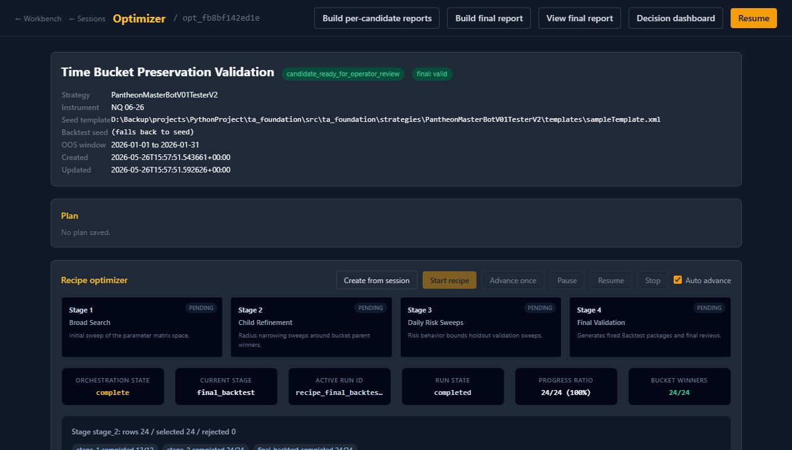
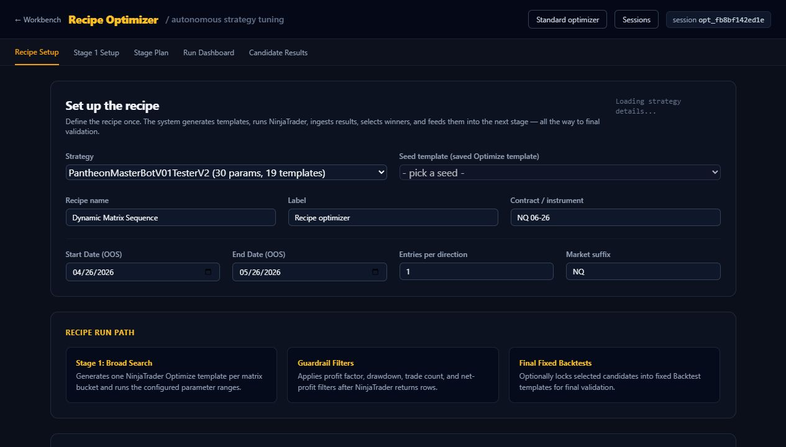
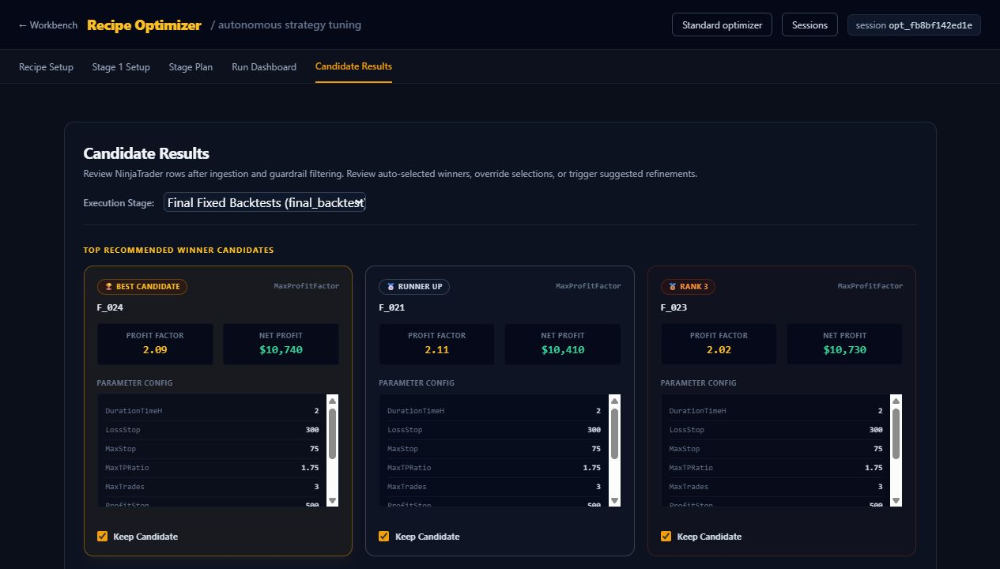
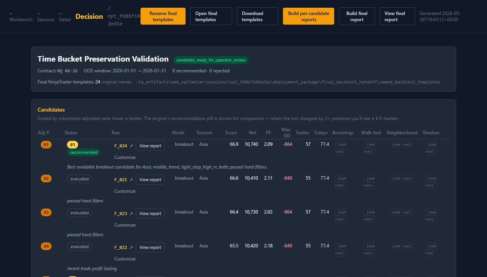
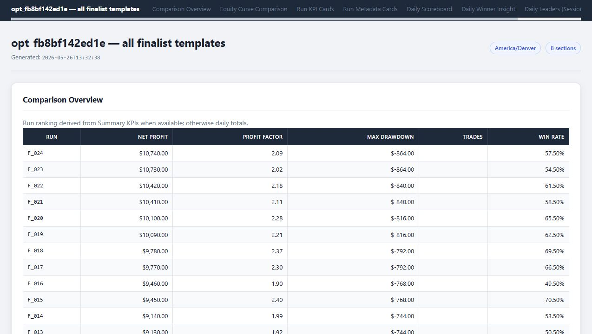
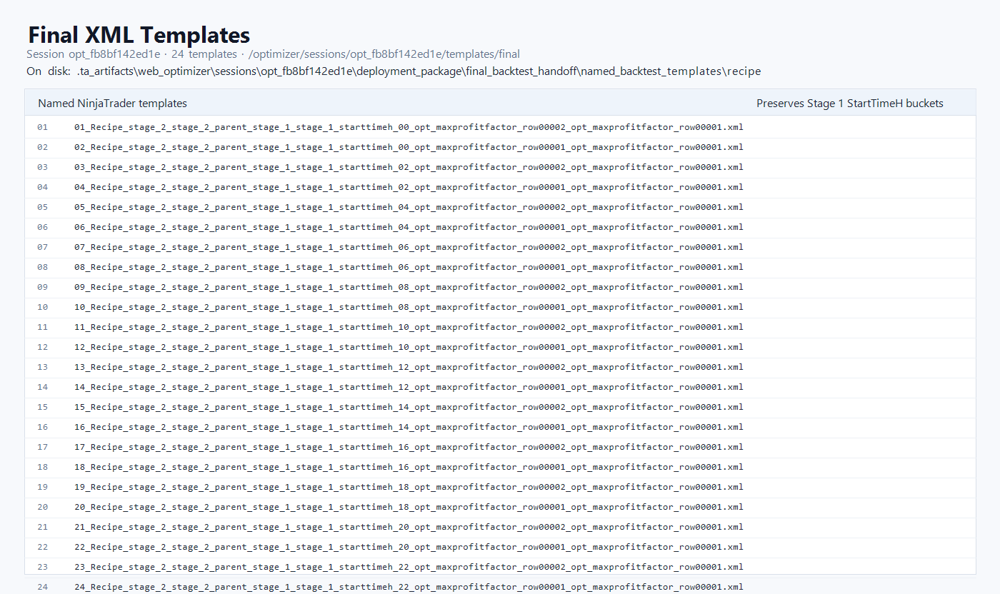

# Recipe Optimizer User Guide

This guide walks through a completed Recipe Optimizer session and shows where to click to find final results, the final report, and the final NinjaTrader `.xml` templates.

Example validation session:

- Session: `opt_fb8bf142ed1e`
- App URL: `http://127.0.0.1:7734`
- Goal: see final results, the final report, and the final NinjaTrader `.xml` templates.

If the app is not running, start it from `D:\Backup\projects\PythonProject\ta_foundation`:

```powershell
$env:PYTHONPATH='src'
python -m ta_foundation.web.app --port 7734
```

## 1. Open The Session

Open the session detail page:

```text
http://127.0.0.1:7734/optimizer/sessions/<session_id>
```

Example:

```text
http://127.0.0.1:7734/optimizer/sessions/opt_fb8bf142ed1e
```

This is the session detail page. Use the top-right buttons when you want to rebuild or view reports.



Click:

- `Resume` to enter the Recipe Optimizer workflow.
- `Decision dashboard` to jump to the final review dashboard.
- `Build final report` if the final report needs to be generated.
- `View final report` to open the all-candidate final HTML report.

## 2. Resume To The Recipe Optimizer

From the session detail page, click `Resume`.

That opens the Recipe Optimizer. The first screen is recipe setup.



For an already-completed run, you usually do not need to change setup values. Go straight to the results.

Click:

- `Candidate Results` in the top tab bar.

## 3. Load Final Results

On `Candidate Results`, use the `Execution Stage` dropdown.

Select:

- `Final Fixed Backtests (final_backtest)`

The final table should load. At the top of this section you should see `Final Review Next Steps`.



Click options here:

- `Decision dashboard`: opens the final decision dashboard.
- `Reports & refine`: returns to the session detail page.
- `Build final report`: builds the all-candidate finalist HTML report.
- `View final report`: opens the generated final report.
- `Open templates`: lists the final NinjaTrader XML templates.
- `Download templates`: downloads a ZIP of the final XML templates.

In the final results table, check the `StartTimeH` column. For the validation run it should include the original time buckets:

```text
0, 2, 4, 6, 8, 10, 12, 14, 16, 18, 20, 22
```

## 4. Open The Decision Dashboard

Open the dashboard URL:

```text
http://127.0.0.1:7734/optimizer/sessions/<session_id>/decision
```

Example:

```text
http://127.0.0.1:7734/optimizer/sessions/opt_fb8bf142ed1e/decision
```



Use the top buttons:

- `Rename final templates`: optional; creates friendlier final template names.
- `Open final templates`: browser listing of final XML templates.
- `Download templates`: ZIP of final XML templates.
- `Build per-candidate reports`: builds one report per finalist.
- `Build final report`: builds the all-candidate comparison report.
- `View final report`: opens the all-candidate final report.

In the candidate table:

- Click a candidate id, such as `F_024`, to open that candidate's report.
- Click `View report` beside a candidate to open that same single-candidate report.
- Click `Customize` to choose report sections and rebuild that candidate report.

## 5. View The Final Report

Open the final report URL:

```text
http://127.0.0.1:7734/optimizer/sessions/<session_id>/candidate-report
```

Example:

```text
http://127.0.0.1:7734/optimizer/sessions/opt_fb8bf142ed1e/candidate-report
```



This is the all-candidate final report. It should show different finalist metrics, including varied win rates when the underlying final `Summary.csv` files differ.

Example from the rebuilt validation report:

```text
F_024 57.50%
F_023 54.50%
F_022 61.50%
F_018 69.50%
F_016 49.50%
F_003 70.50%
F_001 50.50%
```

If this page is missing or stale:

1. Go back to the Decision dashboard.
2. Click `Build final report`.
3. Click `View final report`.

## 6. See The Final XML Templates In The Browser

Open the final template list:

```text
http://127.0.0.1:7734/optimizer/sessions/<session_id>/templates/final
```

Example:

```text
http://127.0.0.1:7734/optimizer/sessions/opt_fb8bf142ed1e/templates/final
```



This page lists the final XML files that are available to load into NinjaTrader.

You can also download them as a ZIP:

```text
http://127.0.0.1:7734/optimizer/sessions/<session_id>/templates/final.zip
```

The ZIP uses short NinjaTrader-safe filenames such as:

```text
F_001_StartTimeH_00.xml
F_002_StartTimeH_00.xml
F_003_StartTimeH_02.xml
```

Those short names are the files to copy into NinjaTrader. The longer internal
template names remain in the session manifest and reports for lineage.

## 7. Find The XML Files On Disk

Generated final XML templates:

```text
D:\Backup\projects\PythonProject\ta_foundation\.ta_artifacts\web_optimizer\sessions\<session_id>\generated_templates\final_backtest
```

Named final handoff XML templates:

```text
D:\Backup\projects\PythonProject\ta_foundation\.ta_artifacts\web_optimizer\sessions\<session_id>\deployment_package\final_backtest_handoff\named_backtest_templates\recipe
```

The named handoff folder is the friendlier folder to use from NinjaTrader. The generated folder is the direct output from final template generation.

## 8. Find Reports On Disk

All-candidate final report:

```text
D:\Backup\projects\PythonProject\ta_foundation\.ta_artifacts\web_optimizer\sessions\<session_id>\deployment_package\session_candidate_report.html
```

Per-candidate reports:

```text
D:\Backup\projects\PythonProject\ta_foundation\.ta_artifacts\web_optimizer\sessions\<session_id>\deployment_package\per_candidate_reports
```

Final review JSON/CSV/Markdown:

```text
D:\Backup\projects\PythonProject\ta_foundation\.ta_artifacts\web_optimizer\sessions\<session_id>\deployment_package\final_backtest_handoff\final_backtest_review
```

## 9. Real NinjaTrader Step

For the validation session, returned final CSVs were synthetic but shaped like NinjaTrader output. For a real NinjaTrader run:

1. Run the XML files from:

```text
D:\Backup\projects\PythonProject\ta_foundation\.ta_artifacts\web_optimizer\sessions\<session_id>\generated_templates\final_backtest
```

2. Put the returned NinjaTrader output folders under:

```text
D:\Backup\projects\PythonProject\ta_foundation\.ta_artifacts\web_optimizer\sessions\<session_id>\nt_output\final_backtest
```

3. Return to the Recipe Optimizer `Candidate Results` tab.
4. Select `Final Fixed Backtests (final_backtest)`.
5. Click `Decision dashboard`.
6. Click `Build final report`.
7. Click `View final report`.
