# Weekly Optimization & Report Building — Step-by-Step Guide

Status: current, written 2026-06-04. Screenshots captured from a live web UI
against the completed reference session `opt_3f4050fadb0c`.

This is the hands-on, click-by-click guide for running a **Weekly Coverage**
optimization and turning it into the deployable team package and reports. For the
deeper reference (folder layout, package internals, lane diversity rules) see
[`weekly_coverage_package_user_guide.md`](weekly_coverage_package_user_guide.md).

If the goal is the newer **full fixed matrix of final templates** for the
daily-prediction pool, use **Deployment Matrix** instead:
[`deployment_matrix_user_guide.md`](deployment_matrix_user_guide.md) and
`/optimizer/deployment-matrix`. Weekly Coverage ships a diverse weekly set.
Deployment Matrix fills the 252-cell predictor-facing grid.

When interpreting the NT optimizer rows behind either flow, read
[`nt_optimizer_evidence_and_rag_guide.md`](nt_optimizer_evidence_and_rag_guide.md)
first. It explains the local NT docs RAG location, `OptimizationFitness`,
`KeepBestResults`, PF-first one-trade traps, and how MAE/MFE/tick evidence
should shape final template selection.

---

## What this workflow does

One **Weekly Coverage** run sweeps a fixed grid of trading lanes and produces a
deployable set of named NinjaTrader templates — two (or more) operationally
distinct winners per lane.

Weekly Coverage is not the same output as the 252-cell Deployment Matrix:

- Weekly Coverage: session bucket x side x slow-MA lanes, multiple deployable
  winners per lane, built for weekly shipping and team handoff.
- Deployment Matrix: 7 sessions x 2 single/multi x 9 MA tiers x 2 god/monster,
  one best template per cell plus explicit fallback/missing status, built for
  the downstream daily-prediction selector.

As of 2026-06-04 the run is **one launch, three automatic stages**:

1. **Broad search** — sweeps MA / stop / target per lane and keeps the best
   *N* structural winners per lane (you choose *N* via **Templates per bucket**).
2. **Risk-knob refine** — for each lane winner, sweeps **ProfitStop / LossStop /
   MaxTrades** (max profit / max loss / max trades) and keeps the single
   best-tuned variant. Your per-bucket count is preserved.
3. **Final validation** — fixed backtests on the refined winners, filtered by
   your guardrails.

You no longer open a separate page for the risk stage — it runs inline. (A
manual risk-refine page still exists for optional extra tuning.)

---

## Prerequisites

- **NinjaTrader 8 running** with the batch-control AddOn deployed. NT cold-starts
  take 1–2 minutes; wait before launching.
- **The web app running**: `python -m ta_foundation.web.app --port 7739`
  (any free port). Open `http://127.0.0.1:7739/optimizer/weekly-coverage`.
- A **strategy with a seed template**. Pantheon (`PantheonMasterBotV01TesterV2`)
  is auto-selected; if no seed exists, click **Generate weekly seed** (no NT
  download needed).

---

## Step 1 — Open the Weekly Coverage page

Go to **`/optimizer/weekly-coverage`**. The top panel states the fixed grid and
the three-stage flow, and the default lane math (72 lanes, up to 144 deployable
templates).

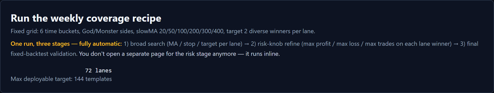

---

## Step 2 — Pick the strategy and seed

The **Strategy** drop-down defaults to Pantheon. The **Seed template** auto-fills
with the matching recipe seed. Set the **Run label**, **Instrument** (must carry
the full contract, e.g. `NQ 06-26`), and **Market suffix**. Set the **Final
backtest start / end** dates for the validation stage.

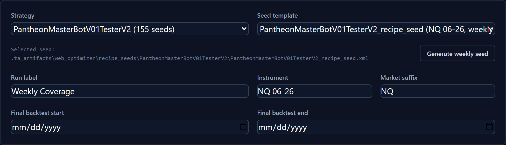

> If the seed drop-down is empty, click **Generate weekly seed** — it builds a
> pinned seed in the project seed store. You never need to save a template from
> NinjaTrader first.

---

## Step 3 — Set the validation guardrails

These filters decide which final backtests are allowed into the package:

- **Min trades**, **Min PF**, **Max DD**, **Min net**, **Min % days traded**.

Defaults (20 / 1.2 / 2500 / 0 / 20) are a reasonable starting point. **Reset
defaults** restores them.

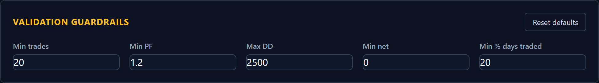

---

## Step 4 — Set the lane grid and per-bucket count

The lanes are **start hours × 2 directions (God/Monster) × slow-MA values**.

- **Session start hours** — one time bucket per hour (default `0, 4, 8, 12, 16, 20`).
- **Session duration (hours)** — bucket length.
- **Templates per bucket** — how many winners to keep per lane. **This number is
  what flows all the way through to the deployable package** — set it to what you
  want shipped (e.g. `4`).
- **Slow MA lane values** — defines the lanes (default `20, 50, 100, 200, 300, 400`).

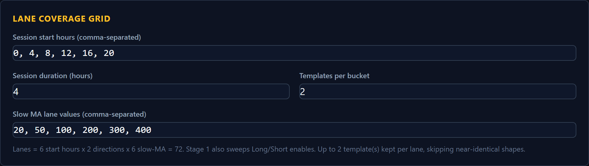

---

## Step 5 — Risk refinement (auto-chained)

This is the stage that sweeps **max profit / max loss / max trades**. It is **on
by default**.

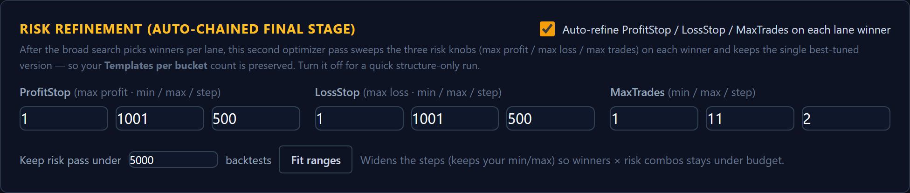

- Leave **Auto-refine…** checked to sweep ProfitStop / LossStop / MaxTrades on
  each lane winner. Uncheck it for a quick structure-only run (risk knobs stay at
  seed defaults).
- Edit the three ranges if you want (min / max / step).
- **Keep the cost in check with one click:** type a budget into **Keep risk pass
  under … backtests** and press **Fit ranges**. It widens the steps (keeping your
  min/max) until `winners × risk-combos` fits the budget. Below, the MaxTrades
  step was auto-widened so the pass targets ≤ 34 risk combos per winner.

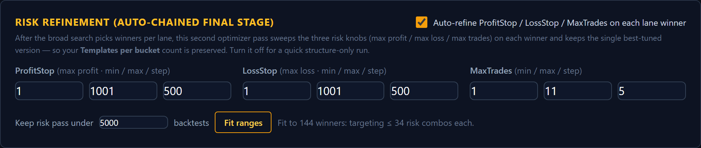

---

## Step 6 — Review the estimate and run

The scope line shows the broad-search backtest count and a second amber line for
the **risk pass** (winners × risk combos). When the numbers look right, click
**Run weekly coverage**.

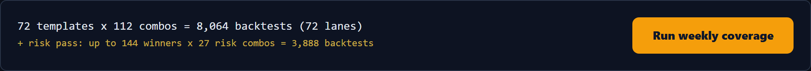

> **Volume note:** the risk pass multiplies backtests. On a full 84-lane grid at
> 4/bucket the default ranges add ~18k backtests; **Fit ranges** brings that down
> (e.g. ~4k under a 5,000 budget). Use it before launching a large grid.

After you click Run, the request is sent to NinjaTrader. Keep the page open.

---

## Step 7 — Watch the run (three stages, automatic)

The **Last weekly run** panel appears and polls status. It advances itself
through all three stages — you'll see `1/3 broad search`, then
`2/3 risk-knob refine`, then `3/3 final validation`. When the final backtests are
ingested it turns green:

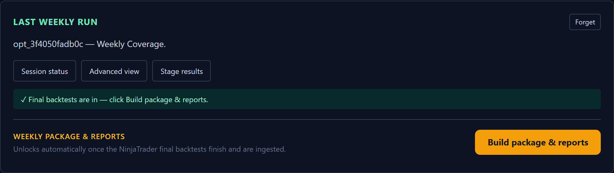

The panel survives a browser restart. If you lose it, use **Resume a recent
weekly run** higher up the page to pick the session back up from any browser.

---

## Step 8 — Build the package and reports

Once the status is green, click **Build package & reports**. The builder reads the
final backtest review (it does **not** rerun NinjaTrader), copies the best named
templates per lane, and unlocks the report links. The summary shows how many
templates were validated and how many lanes were covered (here: 34 validated,
17 / 84 lanes covered — this reference session was a partial run).

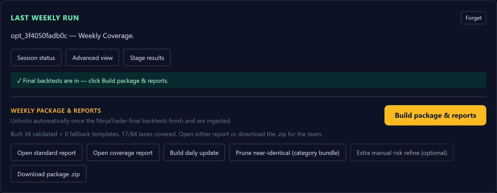

From here you can:

- **Open standard report** — per-candidate finalist report.
- **Open coverage report** — the lane coverage package report (Step 9).
- **Build daily update** — lightweight daily progress report.
- **Prune near-identical (category bundle)** — collapse duplicate shapes.
- **Extra manual risk refine (optional)** — only if you want to hand-pick winners
  and re-sweep risk knobs with different ranges (the run already did one pass).
- **Download package .zip** — the deployable bundle for the team.

---

## Step 9 — Read the coverage report

**Open coverage report** shows the package summary cards, the **lane coverage
table** (which buckets × sides × slowMA got validated winners), the best-effort
fallbacks, and the full template manifest with parameters.

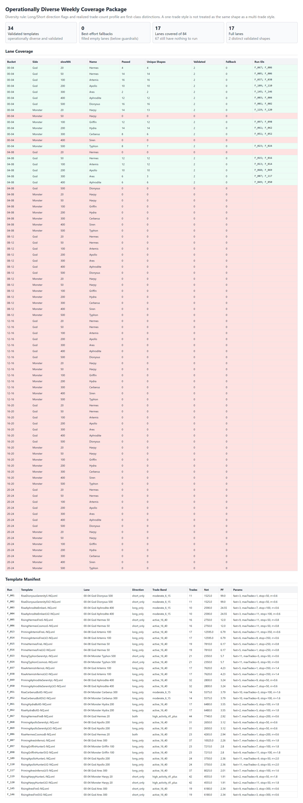

---

## Step 10 — See exactly which lanes are covered

To see coverage as a grid (and optionally refine further), open the **Refine**
page for the session. The **Lane coverage** panel maps every lane:

- **green** = covered with validated winners (the number is how many),
- **amber** = thin / fallback only,
- **red** = nothing ran.

Hover any cell for its run ids. This is the fastest way to spot gaps before a
re-run.

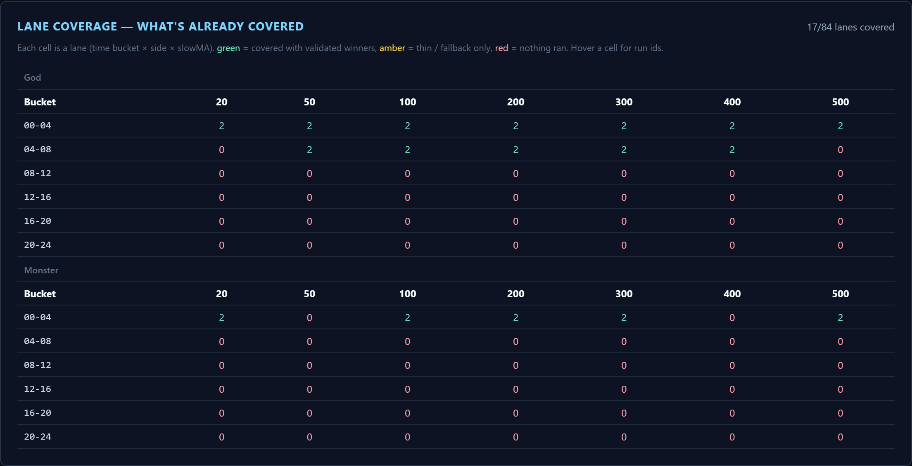

---

## Step 11 — Decision dashboard and leaderboard

The **Decision** dashboard ranks every finalist by robustness-adjusted score,
with per-check badges (bootstrap / walk-forward / neighborhood / shadow). Rename
final templates, build reports, or hand-pick rows here.

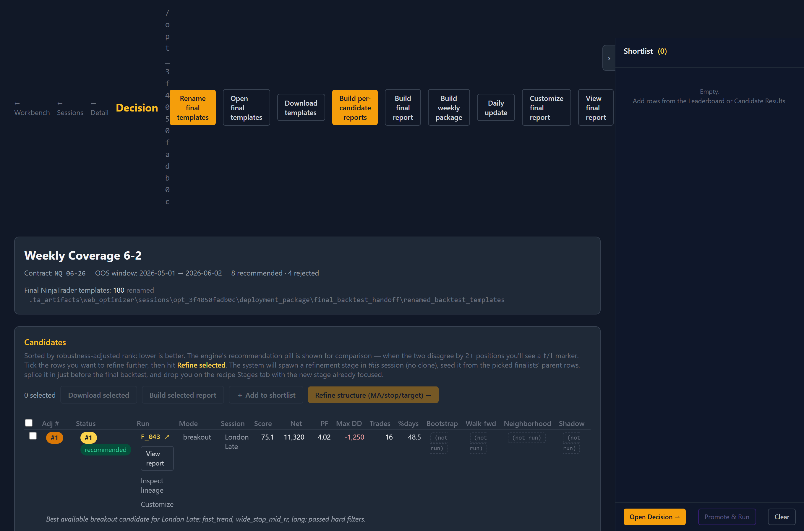

The **Leaderboard** ranks *every* backtest the recipe scored — including rows the
optimizer didn't pick — so nothing is hidden.

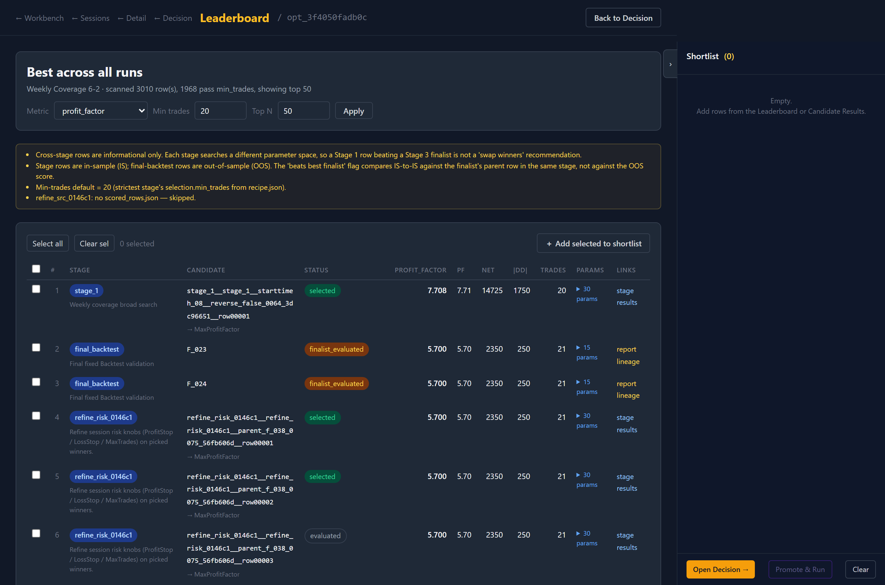

---

## Quick reference

| You want… | Do this |
|---|---|
| Ship more templates per lane | Raise **Templates per bucket** (Step 4) |
| Sweep max profit / loss / trades | Leave **Auto-refine** on (Step 5) — it's automatic |
| Keep the run cheap | **Fit ranges** with a budget (Step 5) |
| Skip the risk sweep | Uncheck **Auto-refine** (Step 5) |
| See what's covered | Refine page → lane coverage grid (Step 10) |
| Hand off to the team | **Download package .zip** (Step 8) |

## Notes and gotchas

- **Per-bucket count is preserved end-to-end.** The risk pass keeps one tuned
  variant per lane winner, so "Templates per bucket = 4" yields 4 risk-optimized
  templates per lane, not 8.
- **Restart the web app** after pulling code that changes routes or the recipe
  builder — routes load at import.
- Existing sessions keep their original recipe; only **new** runs use the
  three-stage flow.
- Contracts must be fully qualified (`NQ 06-26`, not `NQ`) — preflight enforces it.

See also: [`weekly_coverage_package_user_guide.md`](weekly_coverage_package_user_guide.md),
[`recipe_optimizer_user_guide.md`](recipe_optimizer_user_guide.md),
[`pantheon_web_optimizer_full_run.md`](pantheon_web_optimizer_full_run.md).
